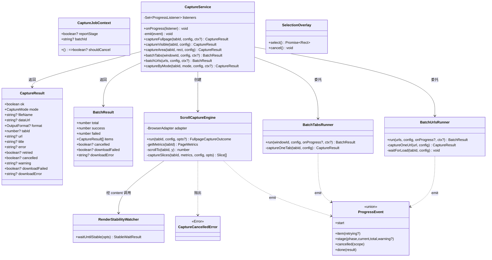
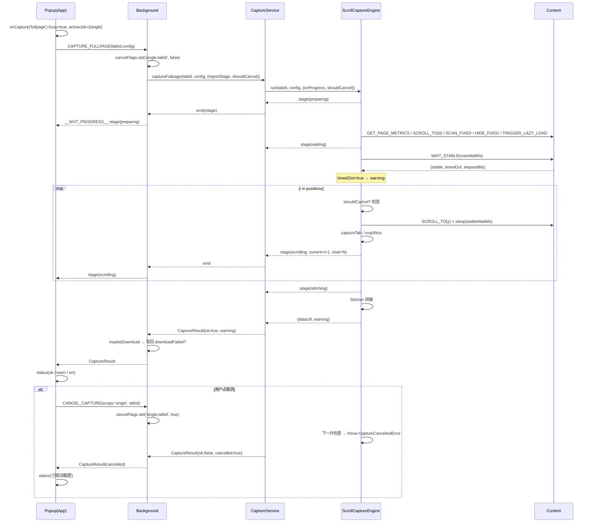
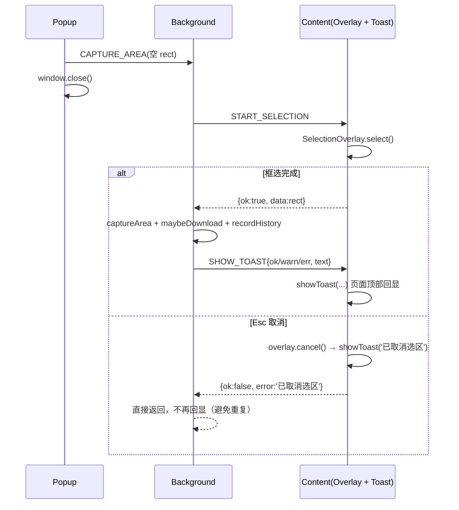
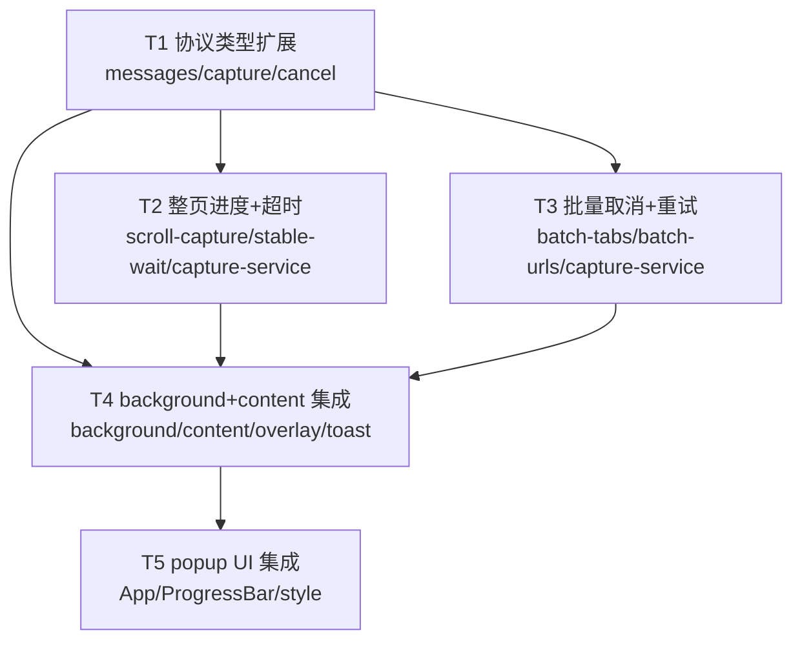

# 网页截图助手 · P0 交互优化架构设计（进度 / 取消 / 超时消息协议扩展 + 任务分解）

> 文档类型：架构设计 + 任务分解（仅设计，不含实现代码）
> 基线版本：v1.1.0
> 范围：P0 优化项 A1~A5（统一消息协议扩展，避免三处各自改协议冲突）
> 输入：`docs/UX-INTERACTION-ANALYSIS.md`
> 作者：架构师（software-architect-3）

---

## 一、实现方案总览

### 1.1 核心难点与选型

| 难点 | 现状 | 设计决策 |
| --- | --- | --- |
| 单张（整页）全程无进度 | `ScrollCaptureEngine` 不 `emit`，`CaptureService.captureFullpage` 无进度通道 | 复用 **`ProgressEvent` 判别联合**，新增 `kind:'stage'` 分阶段事件；`ScrollCaptureEngine.run()` 接受 `onProgress` 回调，经 `CaptureService.emit()` → `background.onProgress` → `__WXT_PROGRESS__` 转发到 popup（**该链路已存在，零新增通道**） |
| 超时被静默吞掉 | `waitUntilStable` 恒返回 `{stable:true}` | 返回值扩展为 `{stable, timedOut, elapsedMs}`，透传到 `CaptureResult.warning`，popup 黄色提示 |
| 下载失败静默吞掉 | `maybeDownload` 只 `log.error` | `maybeDownload` 写回 `CaptureResult.downloadFailed/downloadError`，popup 区分「截图成功 / 下载失败」 |
| 选区无回显（popup 已关） | fire-and-forget + `window.close()` | 选定**页面内 overlay toast**（确定性结论，见 §4.3）：`SelectionOverlay` 取消时本地 toast，背景完成时通过新增 `SHOW_TOAST` content 消息回显 |
| 取消能力缺失 | 整页/批量无取消入口 | 背景侧 `Map<string,boolean>` 取消标志（per-single-tab / per-batch），`ScrollCaptureEngine`/runner 在每片/每项之间检查，新增 `CANCEL_CAPTURE` 请求 |

### 1.2 架构模式

- 沿用现有 **分层 + 消息驱动** 架构：`popup`（React UI）→ `background`（Service Worker 编排）→ `core/*`（业务引擎）→ `content`（页面脚本）。
- 新增一个**统一运行上下文 `CaptureJobContext`**（取消检查回调 + 进度路由开关 + 批量任务 id），贯穿 `background → CaptureService → Engine/Runner`，是 A1/A4/A5 共用的关键抽象，避免各自改签名。
- **最小变更原则**：不重写 `ScrollCaptureEngine`/`Stitcher`/`SelectionCapture` 核心逻辑，仅在关键检查点插入「取消检查 + 进度发射」。

### 1.3 关键设计原则（防冲突）

1. **单一协议来源**：所有进度/取消/超时语义只进 `types/messages.ts` 与 `types/capture.ts`，三端共享判别联合类型。
2. **取消用「抛错 + 捕获」建模**：`CaptureCancelledError`（`core/cancel.ts`），引擎在检查点抛出，`CaptureService` 捕获后转 `CaptureResult{cancelled:true}`，保证返回类型不破坏既有 `ok/error` 契约。
3. **批量与单张进度隔离**：`captureByMode`（批量内）调用 `captureFullpage` 时**不开启 `reportStage`**，避免批量 `item` 进度被嵌套 `stage` 污染。

---

## 二、统一消息协议扩展（完整类型签名）

### 2.1 `types/capture.ts`（修改）

```ts
/** 单次截图结果（扩展） */
export interface CaptureResult {
  ok: boolean;
  mode: CaptureMode;
  fileName?: string;
  dataUrl?: string;
  format?: OutputFormat;
  tabId?: number;
  url?: string;
  title?: string;
  error?: string;
  retried?: boolean;
  // —— P0 新增 ——
  /** 用户主动取消（A5） */
  cancelled?: boolean;
  /** 警告提示，如「页面等待超时，内容可能未加载完整」（A4） */
  warning?: string;
  /** 截图成功但下载失败（A2） */
  downloadFailed?: boolean;
  /** 下载失败原因（A2） */
  downloadError?: string;
}

/** 批量截图汇总（扩展） */
export interface BatchResult {
  total: number;
  success: number;
  failed: number;
  items: CaptureResult[];
  // —— P0 新增 ——
  /** 批量任务被用户取消（A5） */
  cancelled?: boolean;
  /** Zip 打包下载失败（A2） */
  downloadFailed?: boolean;
  downloadError?: string;
}
```

### 2.2 `types/messages.ts`（修改）

```ts
// —— 取消粒度 ——
export type CancelScope = 'single' | 'batch';

// —— 单张整页分阶段（A1） ——
export type FullpagePhase =
  | 'preparing'   // 采集度量 / 回顶 / 扫描 fixed / 懒加载
  | 'waiting'     // 等待页面渲染稳定（可携带 warning=超时）
  | 'scrolling'   // 逐片滚动截图（携带 current/total 百分比）
  | 'stitching'   // 拼接合成
  | 'downloading';// 下载 / 写历史（可选，background 侧触发）

// —— 进度事件（判别联合扩展） ——
export type ProgressEvent =
  | { kind: 'start'; total: number; batchId?: string; label?: string }
  | { kind: 'item'; index: number; total: number; label: string; retrying?: boolean }
  | { kind: 'stage'; phase: FullpagePhase; label: string; current?: number; total?: number; warning?: string }
  | { kind: 'cancelled'; scope: CancelScope; message: string }
  | { kind: 'done'; result: BatchResult; warning?: string };

// —— 选区/页面 toast 种类 ——
export type ToastKind = 'ok' | 'err' | 'warn' | 'info';

// —— content → background 响应数据类型映射更新 ——
export type ContentResponseData =
  | PageMetrics
  | FixedElementInfo[]
  | { stable: boolean; timedOut: boolean; elapsedMs: number } // ← 原 { stable; elapsedMs } 扩展
  | Rect
  | { restored: number }
  | { y: number };

// —— background → content 新增 SHOW_TOAST ——
export type ContentRequest =
  | /* ...原有... */
  | { type: 'SHOW_TOAST'; payload: { kind: ToastKind; text: string } };

// —— popup → background 新增 CANCEL_CAPTURE ——
export type CancelCapturePayload =
  | { scope: 'single'; tabId: number }
  | { scope: 'batch'; batchId: string };

export type PopupRequest =
  | /* ...原有... */
  | { type: 'CANCEL_CAPTURE'; payload: CancelCapturePayload };

// —— 截图任务运行上下文（background 注入取消检查与进度路由，A1/A4/A5 共用） ——
export interface CaptureJobContext {
  /** 取消检查：每片/每项之间调用，返回 true 表示中止（A5） */
  shouldCancel?: () => boolean;
  /** 单张整页是否向前端推送 stage 分阶段进度（批量内不传，防污染）（A1） */
  reportStage?: boolean;
  /** 批量任务 id（start 事件携带，popup 取消定位用）（A5） */
  batchId?: string;
}
```

### 2.3 新增 `core/cancel.ts`（新增文件）

```ts
/** 用户主动取消的标记错误（core 内部抛/捕获用，不污染通用 error 文案） */
export class CaptureCancelledError extends Error {
  constructor(message = '已取消截图') {
    super(message);
    this.name = 'CaptureCancelledError';
  }
}

export function isCaptureCancelled(err: unknown): boolean {
  return err instanceof Error && err.name === 'CaptureCancelledError';
}
```

---

## 三、A1~A5 分项设计

### 3.1 A1 整页分阶段 + 百分比进度

**链路**：`ScrollCaptureEngine`（emit stage）→ `CaptureService`（`reportStage` 时转发 `this.emit`）→ `background.onProgress`（已存在，`__WXT_PROGRESS__` 推送）→ popup `ProgressBar`（渲染 stage）。

**阶段划分**（对应 `FullpagePhase`）：

| 阶段 | 触发点 | label 示例 | 是否带百分比 |
| --- | --- | --- | --- |
| `preparing` | `run()` 开始，采集度量/回顶/扫 fixed/懒加载 | 「正在准备截图…」 | 否 |
| `waiting` | `WAIT_STABLE` 前 | 「等待页面渲染稳定…」 | 否（可带 `warning`） |
| `scrolling` | 逐片循环内 | 「正在滚动截图」 | 是（`current=i+1` / `total=positions.length`） |
| `stitching` | 恢复 fixed/回顶后，`Stitcher` 前 | 「正在拼接合成…」 | 否 |
| `downloading` | 由 background 在下载前补充（可选） | 「正在下载…」 | 否 |

**总屏数预取**：`captureSlices` 内 `positions = buildPositions(scrollVh, fullHeight, step)`，`total = positions.length` 在循环开始前即可拿到，无需改动 `buildPositions`。

`ScrollCaptureEngine` 签名变化：

```ts
export interface FullpageCaptureOutcome {
  dataUrl: string;
  warning?: string; // A4 超时透传
}

export interface ScrollRunOptions {
  onProgress?: (event: ProgressEvent) => void;
  shouldCancel?: () => boolean; // A5
}

export class ScrollCaptureEngine {
  async run(
    tabId: number,
    config: CaptureConfig,
    opts: ScrollRunOptions = {},
  ): Promise<FullpageCaptureOutcome> { /* ... */ }
}
```

`captureSlices` 逐片检查取消 + 发射 `stage(scrolling)`（伪代码）：

```ts
for (let i = 0; i < positions.length; i += 1) {
  if (opts.shouldCancel?.()) throw new CaptureCancelledError(); // A5 检查点
  // ...scrollTo / sleep / captureTab / cropSlice...
  opts.onProgress?.({
    kind: 'stage',
    phase: 'scrolling',
    label: '正在滚动截图',
    current: i + 1,
    total: positions.length,
  });
}
```

### 3.2 A2 下载结果透传

`maybeDownload` / `maybeDownloadZip` 由 `void` 改为**写回结果对象**：

```ts
// background.ts
async function maybeDownload(result: CaptureResult, config: CaptureConfig): Promise<void> {
  if (result.ok && result.dataUrl && result.fileName) {
    try {
      const path = resolveDownloadPath(config.saveSubfolder, result.fileName);
      await downloadDataUrl(result.dataUrl, path);
      // 成功：downloadFailed 保持 undefined（=false 语义）
    } catch (e) {
      result.downloadFailed = true;
      result.downloadError = toErrorMessage(e);
      log.error('下载失败', e);
    }
  }
}

async function maybeDownloadZip(result: BatchResult, config: CaptureConfig): Promise<void> {
  if (result.success === 0) return;
  try { /* ...zip + download... */ }
  catch (e) {
    result.downloadFailed = true;
    result.downloadError = toErrorMessage(e);
    log.error('Zip 打包下载失败', e);
  }
}
```

popup 区分（见 §3.5）：`ok && !downloadFailed` → 「已下载」；`ok && downloadFailed` → `warn`「✅ 截图完成，⚠️ 下载失败：<原因>」。

### 3.3 A3 选区成功/失败/取消回显闭环

**确定性结论：采用「页面内 overlay toast」**（不用 `browser.notifications`，也不自动重开 popup）。理由：
- `browser.notifications` 需授权、SW 场景行为分平台差异大，Chrome MV3 与 Firefox 表现不一致。
- 自动重开 popup 依赖浏览器焦点策略（`chrome.windows.update` 对 popup 不可靠），成本高，列为 P1。
- overlay toast 无权限、无跨平台差异，选区页面本身就在前台，回显自然。

**实现**：新增 `core/content/toast.ts`（页面顶部居中、2.5s 自动消失、可堆叠的轻量 DOM toast）。两处触发：
1. **取消**：`SelectionOverlay.cancel()` 在 `cleanup() + reject` 后调用 `showToast('info', '已取消选区')`（本地即时，无需 background 往返）。
2. **成功/失败/下载失败**：background 完成 `captureArea + maybeDownload + recordHistory` 后，向该 tab 发 `SHOW_TOAST`：

```ts
// background.ts
async function notifyAreaResult(tabId: number, result: CaptureResult): Promise<void> {
  let kind: ToastKind = 'info';
  let text = '';
  if (!result.ok) {
    kind = 'err';
    text = `选区截图失败：${result.error ?? '未知错误'}`;
  } else if (result.downloadFailed) {
    kind = 'warn';
    text = `选区截图已生成，但下载失败：${result.downloadError ?? ''}`;
  } else {
    kind = 'ok';
    text = `已保存选区截图：${result.fileName ?? ''}`;
  }
  await browser.tabs.sendMessage(tabId, { type: 'SHOW_TOAST', payload: { kind, text } });
}
```

`content.ts` 新增分支：`case 'SHOW_TOAST': showToast(msg.payload.kind, msg.payload.text); return { ok: true, data: null };`

> 取消场景 background 会收到 `startSelection` 返回 `{ok:false, error:'已取消选区'}` 并直接 `return {ok:false}`，不进入 `notifyAreaResult`，避免与 overlay 本地 toast 重复。

### 3.4 A4 超时显式建模

`core/content/stable-wait.ts`：

```ts
export interface StableWaitResult {
  stable: boolean;   // 是否在 maxWaitMs 内达到 networkIdle（内容已稳定）
  timedOut: boolean; // 是否达到 maxWaitMs 仍未稳定
  elapsedMs: number;
}

// waitUntilStable 核心改动
let settled = false;
while (performance.now() - start < maxWaitMs) {
  if (performance.now() - lastActivity >= networkIdleMs) { settled = true; break; }
  await sleep(100);
}
await sleep(Math.max(0, opts.stableWaitMs));
// ...disconnect observers...
return { stable: settled, timedOut: !settled, elapsedMs: Math.round(performance.now() - start) };
```

透传链：`stable-wait` → `ContentResponse.data` → `ScrollCaptureEngine` 读 `stableRes.data.timedOut` 生成 `warning` → `FullpageCaptureOutcome.warning` → `CaptureResult.warning` → popup 黄色提示「⚠️ 页面等待超时，内容可能未加载完整」。

### 3.5 A5 取消机制

**取消标志存储**（background 模块级内存 Map）：

```ts
// background.ts
const cancelFlags = new Map<string, boolean>(); // key: `single:${tabId}` | `batch:${batchId}`
```

**检查点**：
- 整页：`ScrollCaptureEngine.captureSlices` 每片循环开头（§3.1）。
- 批量：`BatchTabsRunner/BatchUrlsRunner` 每项循环开头（重试循环前再查一次）。

**background 路由**：

```ts
case 'CAPTURE_FULLPAGE': {
  const key = `single:${msg.payload.tabId}`;
  cancelFlags.set(key, false);
  const ctx: CaptureJobContext = {
    reportStage: true,                                   // A1
    shouldCancel: () => cancelFlags.get(key) === true,   // A5
  };
  const result = await service.captureFullpage(msg.payload.tabId, msg.payload.config, ctx);
  cancelFlags.delete(key);
  await maybeDownload(result, msg.payload.config);       // A2
  await recordHistory(result, msg.payload.config);
  return { ok: true, data: result };
}

case 'BATCH_TABS': { /* 同 BATCH_URLS */ 
  const batchId = genId();
  const key = `batch:${batchId}`;
  cancelFlags.set(key, false);
  const ctx: CaptureJobContext = { batchId, shouldCancel: () => cancelFlags.get(key) === true };
  const result = await service.batchTabs(msg.payload.windowId, msg.payload.config, ctx);
  cancelFlags.delete(key);
  await maybeDownloadZip(result, msg.payload.config);
  for (const item of result.items) await recordHistory(item, msg.payload.config);
  return { ok: true, data: result };
}

case 'CANCEL_CAPTURE': {
  const key = msg.payload.scope === 'single'
    ? `single:${msg.payload.tabId}`
    : `batch:${msg.payload.batchId}`;
  if (!cancelFlags.has(key)) return { ok: true, data: { cancelled: false } };
  cancelFlags.set(key, true);
  return { ok: true, data: { cancelled: true } };
}
```

**中止语义**：
- 单张：`ScrollCaptureEngine` 抛 `CaptureCancelledError` → `CaptureService.captureFullpage` 捕获 → 返回 `{ ok:false, cancelled:true, error:'已取消截图' }`。
- 批量：runner 在取消点停止，剩余项填充 `{ ok:false, cancelled:true, error:'已取消' }` 占位，`result.cancelled=true`，并 emit `{kind:'cancelled', scope:'batch', ...}` + `{kind:'done'}`。

**批量进度 `start` 携带 batchId**（popup 取消定位用）：runner `onProgress?.({ kind:'start', total, batchId: ctx?.batchId })`。

### 3.6 popup 侧汇总（A1/A2/A4/A5 展示）

- `status.kind` 增加 `'warn'`（黄色）；`style.css` 新增 `.status-warn` 与 toast/取消按钮/spinner 样式。
- `App.tsx` 新增 `activeJob` 状态（`{kind:'single'} | {kind:'batch'; batchId:string} | null`），`busy` 时渲染「✕ 取消截图」按钮。
- `onCapture` 结果分支：`cancelled` → info「已取消截图」；`ok && downloadFailed` → warn；`ok && warning` → warn（附加提示）；`ok` → ok「已下载」；否则 err。
- `ProgressBar` 支持 `stage`（`scrolling` 显示百分比条，其余显示 label/spinner）与 `cancelled`（显示「已取消」）。

---

## 四、文件清单（新增 / 修改）

### 新增

| 文件 | 说明 |
| --- | --- |
| `core/cancel.ts` | `CaptureCancelledError` + `isCaptureCancelled` |
| `core/content/toast.ts` | 页面内 overlay toast（`showToast(kind,text)`） |

### 修改

| 文件 | 改动点 |
| --- | --- |
| `types/messages.ts` | `ProgressEvent`/`PopupRequest`/`ContentRequest`/`ContentResponseData`/`CaptureJobContext`/`ToastKind`/`CancelScope`/`FullpagePhase` |
| `types/capture.ts` | `CaptureResult`/`BatchResult` 增补 `cancelled/warning/downloadFailed/downloadError` |
| `core/content/stable-wait.ts` | `StableWaitResult` 增加 `timedOut`，返回语义修正 |
| `core/scroll-capture.ts` | `run()` 接受 `ScrollRunOptions`，分阶段 emit，读超时生成 warning，逐片取消检查 |
| `core/capture-service.ts` | `captureFullpage`/`batchTabs`/`batchUrls`/`captureByMode` 接 `CaptureJobContext`，转发 stage，捕获取消 |
| `core/batch-tabs.ts` | 每项取消检查、剩余项占位、`retrying` 标志、`start` 带 batchId、cancelled 事件 |
| `core/batch-urls.ts` | 同 `batch-tabs.ts` |
| `core/content/overlay.ts` | `cancel()` 后本地 `showToast('已取消选区')` |
| `entrypoints/content.ts` | 新增 `SHOW_TOAST` 分发 |
| `entrypoints/background.ts` | `cancelFlags`、`CANCEL_CAPTURE`、`maybeDownload`/`maybeDownloadZip` 写回、`notifyAreaResult`、注入 ctx |
| `entrypoints/popup/App.tsx` | stage 展示、warn 状态、取消按钮、`activeJob`、结果分支 |
| `entrypoints/popup/components/ProgressBar.tsx` | 渲染 `stage`/`cancelled` |
| `entrypoints/popup/style.css` | `.status-warn`、toast、取消按钮、spinner 样式 |

---

## 五、数据结构与接口（类图）



---

## 六、程序调用流程（时序图）

### 6.1 整页截图（进度 + 超时 + 取消）



### 6.2 选区截图（回显 + 取消）



---

## 七、待确认事项（Anything UNCLEAR）

1. **`downloading` 阶段归属**：设计上保留 `FullpagePhase.downloading`，但整页的下载发生在 `background`（`maybeDownload`）而非 `ScrollCaptureEngine`。建议由 background 在 `maybeDownload` 前补一条 `stage(downloading)`（可选，P0 可不发，因为「拼接合成」到「已下载」间隔短）。**默认：A1 先只发 4 个阶段（preparing/waiting/scrolling/stitching），downloading 作为保留枚举。**
2. **取消按钮可见范围**：`visible` 截图 <1s，取消无意义；设计默认取消按钮仅在 `busy && mode !== 'area'` 显示（含 visible，但 visible 因太快基本点不到）。是否对 visible 隐藏取消按钮，交由工程师按 UI 简洁性微调。
3. **批量占位项计入 total**：取消时剩余项以 `cancelled:true` 占位填充，`failed` 计数是否包含「已取消项」——设计默认**计入 failed**（保持 `total = success + failed` 恒等），如需区分「取消」与「失败」，popup 汇总文案单独读 `result.cancelled` 处理。
4. **`stable=false` 且非超时** 的场景（`maxWaitMs<=0` 等极端配置）：`timedOut` 一律按 `!settled` 计算，warning 文案统一「页面等待超时，内容可能未加载完整」，不细分，保持文案简单。

---

## 八、Required Packages

```
（无新增第三方依赖）—— 复用现有 WXT + React + browser 适配层，全部改动为现有代码增量。
```

---

## 九、任务分解（有序，含依赖）

> 说明：本项目为现有代码增量，T1 为「协议契约层」先行（对应新建项目的「基础设施」地位，但此处是类型/契约基础设施），后续任务全部引用 T1 的类型。

### T1 消息协议类型扩展（契约层，无行为变化）
- **涉及文件（新增/修改）**：
  - `types/messages.ts`（改）
  - `types/capture.ts`（改）
  - `core/cancel.ts`（新增）
- **依赖**：无
- **优先级**：P0
- **验收标准**：`ProgressEvent`/`PopupRequest`/`ContentRequest`/`ContentResponseData`/`CaptureJobContext` 等判别联合类型完整；`CaptureResult`/`BatchResult` 增补字段齐全；`core/cancel.ts` 导出 `CaptureCancelledError` + `isCaptureCancelled`；`tsc` 类型检查通过且无运行期行为改变。

### T2 整页分阶段进度 + 超时透传（core 引擎）
- **涉及文件**：
  - `core/scroll-capture.ts`（改）
  - `core/content/stable-wait.ts`（改）
  - `core/capture-service.ts`（改）
- **依赖**：T1
- **优先级**：P0
- **验收标准**：`ScrollCaptureEngine.run()` 接受 `ScrollRunOptions` 并按 preparing→waiting→scrolling(current/total)→stitching 依次 emit `stage`；`waitUntilStable` 返回 `{stable,timedOut,elapsedMs}`；`captureFullpage` 在 `reportStage` 下转发 stage、透传 `warning`、捕获取消并返回 `{cancelled:true}`。

### T3 批量取消 + 批量重试语义（core 引擎）
- **涉及文件**：
  - `core/batch-tabs.ts`（改）
  - `core/batch-urls.ts`（改）
  - `core/capture-service.ts`（改）
- **依赖**：T1
- **优先级**：P0
- **验收标准**：`BatchTabsRunner/BatchUrlsRunner` 每项之间检查 `ctx.shouldCancel`，取消时填充占位项并 `result.cancelled=true`、emit `cancelled` + `done`；`start` 事件携带 `batchId`；重试 `item` 带 `retrying:true`；`batchTabs/batchUrls/captureByMode` 透传 `shouldCancel/batchId`（批量内不开启 `reportStage`）。

### T4 background + content 集成（下载结果 / 选区回显 / 取消路由）
- **涉及文件**：
  - `entrypoints/background.ts`（改）
  - `entrypoints/content.ts`（改）
  - `core/content/overlay.ts`（改）
  - `core/content/toast.ts`（新增）
- **依赖**：T1、T2、T3
- **优先级**：P0
- **验收标准**：`cancelFlags` Map + `CANCEL_CAPTURE` 处理；`CAPTURE_FULLPAGE` 注入 `{reportStage,shouldCancel}`、`BATCH_TABS/URLS` 注入 `{batchId,shouldCancel}`；`maybeDownload/maybeDownloadZip` 写回 `downloadFailed/downloadError`；`notifyAreaResult` 在选区完成/失败/下载失败后发 `SHOW_TOAST`；`overlay.cancel()` 本地 toast；`content.ts` 处理 `SHOW_TOAST`。

### T5 popup UI 集成（进度 / 取消 / 结果展示）
- **涉及文件**：
  - `entrypoints/popup/App.tsx`（改）
  - `entrypoints/popup/components/ProgressBar.tsx`（改）
  - `entrypoints/popup/style.css`（改）
- **依赖**：T4
- **优先级**：P0
- **验收标准**：popup 展示整页 `stage` 分阶段与百分比进度；超时显示黄色 `warning`；下载失败区分「截图完成/下载失败」；`busy` 时显示「✕ 取消截图」并发送 `CANCEL_CAPTURE`（single/batch 两粒度）；取消后状态正确收尾；`.status-warn`/toast/取消按钮/spinner 样式到位。

---

## 十、共享约定（Shared Knowledge）

```
- 进度事件唯一出口：ProgressEvent 判别联合（start/item/stage/cancelled/done），background 统一经 __WXT_PROGRESS__ 推送。
- 单张截图结果经 PopupResponse<CaptureResult> 返回；批量结果经 ProgressEvent.done + PopupResponse<BatchResult> 双通道。
- 取消统一用 CaptureCancelledError 抛出，CaptureService 捕获转 CaptureResult{cancelled:true, ok:false}；禁止在各处散落 '取消' 字符串判断。
- 下载结果：ok=true 时 downloadFailed 缺省=undefined（false 语义）；ok=false 时不得设置 downloadFailed。
- 超时：timedOut 只影响 warning 提示，不改变 ok 结果（超时仍按已加载内容出图）。
- 批量内不开启 reportStage，避免嵌套进度污染批量 item 进度条。
- 选区反馈只用页面内 overlay toast（kind: ok/err/warn/info），不使用 browser.notifications、不自动重开 popup。
- cancelFlags 为 background 内存 Map，任务结束后 delete，避免泄漏；popup 重开不恢复 cancelFlags（取消态不跨会话）。
```

---

## 十一、任务依赖图



> 并行度说明：T2 与 T3 相互独立可并行；T4 需 T2+T3 完成（依赖新的 `captureFullpage/batchTabs` 签名）；T5 最后。
