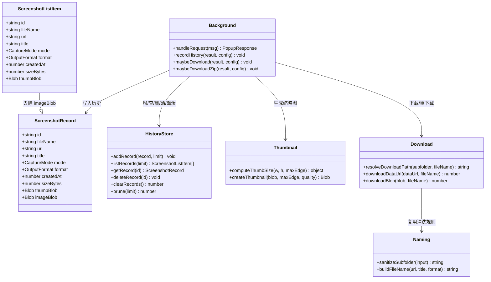
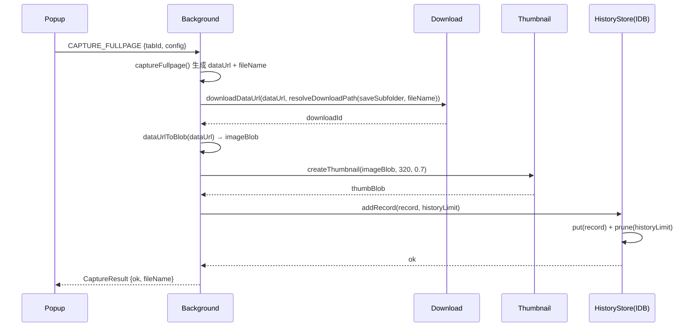
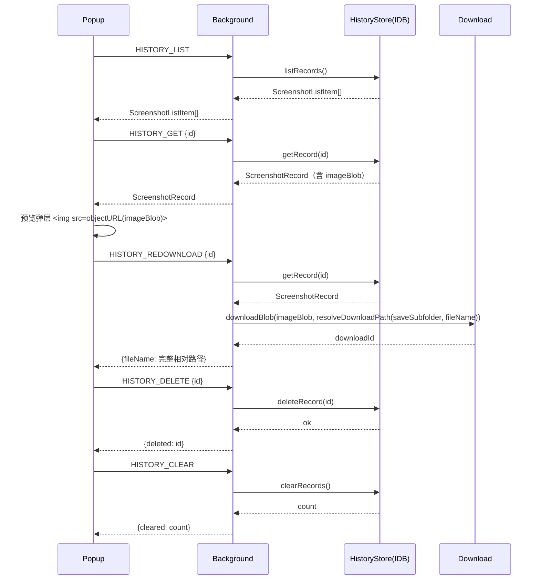
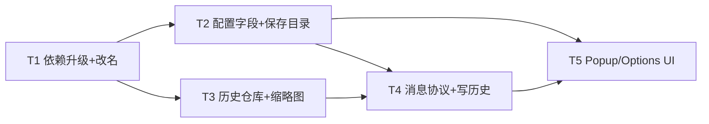

# 网页截图助手 · 增量系统设计 + 增量任务分解

> 文档类型：增量架构设计文档（Increment Architecture Design）
> 作者：架构师
> 语言：中文
> 基线文档：`docs/ARCHITECTURE.md`（v1.0）、`docs/PRD.md`（v1.0）
> 变更依据：`docs/PRD-increment.md`（增量 PRD）
> 技术栈：WXT + Vite + React + TypeScript
> 目标浏览器：Chrome（P0）、Firefox（P0）、Safari（P1 降级）

> **核心约束**：本次为「增量开发」，**不重写截图核心引擎**（整页滚动拼接 `core/scroll-capture.ts`、`core/stitch.ts`、适配层 `adapters/*`、批量 runner `core/batch-*.ts` 全部保持不变）。只做五块外围能力：品牌命名 + 工程依赖 + 保存目录 + 历史记录 + Popup 体验。

---

## 0. 关键决策确认（对应 PRD Open Questions I-1 ~ I-8）

| # | 决策项 | 拍板结论 | 对设计的直接影响 |
| --- | --- | --- | --- |
| I-1 | 默认子文件夹名 | 中文「**网页截图**」；配置项 `saveSubfolder`（空串=下载根目录） | `DEFAULT_CONFIG.saveSubfolder = '网页截图'` |
| I-2 | 依赖升级 | **方案 A**（wxt/vite 升级到最新、解除 `~1.1.5` 与 `@vitejs/plugin-react` override、vite 升 6）；以三目标构建+测试全绿为准，失败回退方案 B | 见 §2.1 |
| I-3 | 批量是否逐条入历史 | **是**，批量按单条记录写入，Zip 本身不入历史 | background 在批量结果上遍历逐条 `recordHistory` |
| I-4 | 历史原图是否保留 | **保留原图**（IndexedDB），配合 `historyLimit` LRU 控制总量；不重截 | `ScreenshotRecord.imageBlob` 长期存 IndexedDB |
| I-5 | 历史默认保留条数 | 默认 **50**，可配置 **1~200** | `DEFAULT_CONFIG.historyLimit = 50`，options 输入 clamp 1~200 |
| I-6 | LRU 淘汰后重新下载 | 列表项随淘汰删除，不会出现「可点但无原图」 | `prune` 删除整条记录（含 Blob） |
| I-7 | 缩略图规格 | 最大边 **320px**，**JPEG q0.7**（不强制 WebP） | `createThumbnail(blob, 320, 0.7)` |
| I-8 | 基线文档标题 | 不改 `docs/PRD.md` / `docs/ARCHITECTURE.md` 标题 | 仅新增本增量文档 |

---

## 1. 变更总览

| # | 变更项 | 新增文件 | 修改文件 | 优先级 |
| --- | --- | --- | --- | --- |
| 1 | 依赖升级（方案 A）+ 项目改名 | — | `package.json`、`package-lock.json`(自动)、`wxt.config.ts`、`README.md`、popup/options 入口 | P0 |
| 2 | 配置字段 + 保存目录 | — | `types/config.ts`、`utils/naming.ts`、`utils/download.ts`、`entrypoints/background.ts` | P0 |
| 3 | IndexedDB 历史仓库 + 缩略图 | `types/history.ts`、`utils/history-store.ts`、`utils/thumbnail.ts` | `utils/helpers.ts`、`types/capture.ts`、`core/capture-service.ts` | P0 |
| 4 | 历史消息协议 + background 路由 + 写历史 | — | `types/messages.ts`、`entrypoints/background.ts` | P0 |
| 5 | Popup Tab 重构 + 历史列表/预览 + Options 扩展 | `entrypoints/popup/components/HistoryList.tsx`、`entrypoints/popup/components/PreviewModal.tsx` | `entrypoints/popup/App.tsx`、`entrypoints/popup/style.css`、`entrypoints/options/App.tsx`、`entrypoints/options/style.css` | P0 |

---

## 2. 逐项增量设计

### 2.1 依赖升级（方案 A）与项目改名

#### 2.1.1 目标依赖版本清单（方案 A）

| 包 | 当前 | 目标（方案 A） | 说明 |
| --- | --- | --- | --- |
| `wxt` | `^0.19.0` | `^0.20.26`（最新稳定，支持 Vite 6） | v0.20 为「v1.0 候选」，含破坏性变更，见风险点 |
| `vite` | `^5.4.8` | `^6.0.0`（最新 6.x） | 随 WXT 0.20 要求升 6 |
| `@wxt-dev/module-react` | `~1.1.5` | `^1.2.1`（最新稳定） | **移除 `~` 锁定** |
| `@vitejs/plugin-react`（override） | `4.4.1` | **移除 override 整段** | 由 module-react 依赖树自动解析 Vite 6 兼容版 |
| `react` / `react-dom` | `^18.3.1` | `^18.3.1`（18 最新补丁） | 本次不跨 19 |
| `@types/react` / `@types/react-dom` | `^18.3.5` / `^18.3.0` | `^18.3.x`（最新补丁） | 随 React 同步 |
| `typescript` | `^5.5.4` | `^5.8.x`（5.x 最新稳定） | 5.x 内升级 |
| `jszip` | `^3.10.1` | `^3.10.1`（3.x 最新稳定） | 基本无变化 |
| `vitest` | `^2.1.9` | `^3.x`（最新稳定） | **必须随 Vite 6 升到 3.x**（vitest 2.x 仅支持 Vite 5） |
| `fake-indexeddb`（新增 devDependency） | — | 最新稳定 | 供 `history-store` 单测在 Node 环境跑 IndexedDB |

> 版本号以 `npm install` 时最新稳定版为准；上表为参考目标区间，工程师安装后用 `npm ls` 复核。

#### 2.1.2 方案 A 的关键迁移风险点（务必逐条验证）

1. **webextension-polyfill 移除**（wxt 0.20 破坏性变更）：WXT 0.19 全局 `browser` 由 polyfill 提供，0.20 起移除 polyfill。
   - 需在 `wxt.config.ts` 明确 `extensionApi: 'chrome'`（让 `browser` 直接映射 `chrome`），并审计 `browser.*` 全局用法。
   - 我们 `entrypoints/background.ts` 已采用 `sendResponse` + `return true` 的 Chrome 回调范式（而非 polyfill 的 Promise 返回范式），**天然兼容 0.20**，无需改。
   - popup/options 的 `browser.runtime.sendMessage(...).then/await`：MV3 Chrome 下 `chrome.runtime.sendMessage` 原生返回 Promise，兼容；Firefox MV2 下 `browser` 为原生 Firefox 命名空间，兼容。逐一冒烟验证。
2. **module-react 注册形式**：0.19 用字符串 `modules: ['@wxt-dev/module-react']`；0.20 建议 `import react from '@wxt-dev/module-react'; modules: [react()]`。升级后按新版本文档调整为函数式注册（字符串形式若仍可用则保留）。
3. **vitest 版本对齐**：Vite 6 必须配 vitest 3.x，否则 `npm test` 起不来。
4. **`wxt prepare` / 类型生成**：升级后用 `npm run postinstall`（`wxt prepare`）重新生成 `.wxt/` 类型，避免 TS 报错。

#### 2.1.3 方案 B（失败回退）判定条件与步骤

**触发回退（满足任一即回退）**：
- 三目标构建 `build:chrome` / `build:firefox` / `build:safari` 任一失败且无法快速定位；
- `npm run compile`（`tsc --noEmit`）出现类型错误且无法在合理时间修复；
- `npm test` 出现相对升级前的回归失败；
- Chrome/Firefox 冒烟：popup/options 无法渲染、或截图链路失败。

**回退步骤**：
1. `git` 还原 `package.json` / `package-lock.json` / `wxt.config.ts` 及相关改动的源码文件到升级前版本；
2. 执行 `npm install` 重建 `node_modules`；
3. 恢复锁定组合：`wxt@^0.19.0` + `vite@^5.4.8` + `@wxt-dev/module-react@~1.1.5` + `overrides.@vitejs/plugin-react@4.4.1` + `vitest@^2.1.9`；
4. 其余包（react/typescript/jszip）仅做 patch 级安全升级；
5. 三目标构建 + `npm test` + `npm run compile` 验证回退后全绿；
6. 记录回退原因，升级单独排期。

#### 2.1.4 项目改名影响面（确定性清单，覆盖 >8 处）

| # | 文件 | 位置 | 当前值 | 目标值 |
| --- | --- | --- | --- | --- |
| 1 | `package.json` | `name` | `wxt-screenshot` | `web-screenshot-assistant` |
| 2 | `package.json` | `description` | `WXT 跨浏览器截图扩展：…` | `网页截图助手：跨浏览器整页滚动截图 / 可见区域 / 选定区域截图 + 批量截图` |
| 3 | `package.json` | `version` | `1.0.0` | `1.1.0` |
| 4 | `wxt.config.ts` | `manifest.name` | `WXT 截图扩展` | `网页截图助手` |
| 5 | `wxt.config.ts` | `manifest.version` | `1.0.0` | `1.1.0` |
| 6 | `README.md` | 标题 | `# WXT 跨浏览器截图扩展` | `# 网页截图助手`（首段简介同步去掉「WXT」品牌残留，可保留技术栈说明） |
| 7 | `entrypoints/popup/App.tsx` | `<h1>` | `WXT 截图扩展` | `网页截图助手` |
| 8 | `entrypoints/popup/index.html` | `<title>` | `WXT 截图扩展` | `网页截图助手` |
| 9 | `entrypoints/options/App.tsx` | `<h1>` | `⚙️ 截图设置` | `⚙️ 网页截图助手 · 设置` |
| 10 | `entrypoints/options/index.html` | `<title>` | `WXT 截图扩展 · 设置` | `网页截图助手 · 设置` |
| 11 | `package-lock.json` | `name` | `wxt-screenshot` | 由 `npm install` 自动重写 |

> 说明：`wxt.config.ts` 的 `manifest.description` 当前值已等于目标值（`跨浏览器整页滚动截图、可见区域截图、选定区域截图与批量截图`），**无需改动**。PRD 中「8 处」为约数，上表是源码层面的完整清单（含两个 `index.html` 的 `<title>` 与 lock 文件）。`manifest.name` 仅 6 字符，满足 Chrome 商店 ≤45 字符限制。

---

### 2.2 保存目录（`saveSubfolder` + `historyLimit`）

#### 2.2.1 配置字段扩展（`types/config.ts`）

```ts
export interface CaptureConfig {
  // ...原字段不变...
  /** 默认保存子文件夹名（下载目录下）；空字符串 = 直接存下载根目录 */
  saveSubfolder: string;
  /** 历史保留条数（LRU 淘汰，1~200），默认 50 */
  historyLimit: number;
}

export const DEFAULT_CONFIG: CaptureConfig = {
  // ...原默认值不变...
  saveSubfolder: '网页截图',
  historyLimit: 50,
};
```

#### 2.2.2 子文件夹名清洗（`utils/naming.ts`，复用现有非法字符集）

`naming.ts` 中已有模块私有 `ILLEGAL_RE = /[\\/:*?"<>|]/g`，直接复用：

```ts
/** 清洗保存子文件夹名：非法字符 → _，禁止 '.'/'..'/路径越界，空串→存根目录 */
export function sanitizeSubfolder(input: string): string {
  let s = (input ?? '').trim();
  s = s.replace(ILLEGAL_RE, '_');   // \ / : * ? " < > | → _（复用 ILLEGAL_RE）
  s = s.replace(/\s+/g, ' ').trim();
  // 禁止当前目录/父目录（路径分隔符已在上一步转 _，此处仅剩字面 '.' 或 '..'）
  if (s === '.' || s === '..') return '';
  // 去首尾 '.'，避免隐藏目录名混淆（可选增强，保持确定性）
  s = s.replace(/^\.+|\.+$/g, '');
  return s.slice(0, 100);           // 长度保护
}
```

清洗规则说明：
- 非法字符 `\/:*?"<>|` → `_`（与文件名清洗同一字符集，**复用点**）。
- 路径分隔符 `/`、`\` 均被替换为 `_`，因此 `../foo` → `.._foo`、`/foo` → `_foo`、`C:\foo` → `C__foo`，**天然无法越界**。
- 仅需显式拦截清洗后整体等于 `.` / `..` 的字符串（`..` → `''`）。
- 空串 / 清洗后为空 → 返回 `''`（= 直接存下载根目录）。

#### 2.2.3 下载路径拼接（`utils/download.ts`）

```ts
import { sanitizeSubfolder } from '@/utils/naming';

/** 拼最终相对路径：saveSubfolder + '/' + fileName；空目录则原样返回 */
export function resolveDownloadPath(saveSubfolder: string, fileName: string): string {
  const dir = sanitizeSubfolder(saveSubfolder);
  return dir ? `${dir}/${fileName}` : fileName;
}
```

- `downloadDataUrl` / `downloadBlob` 函数签名不变（仍接收 `fileName`，只是调用方传入**已拼接完整相对路径**），`browser.downloads.download({ filename })` 的 `filename` 为「下载目录下的相对路径」，子目录不存在时浏览器自动创建（原生行为，无需手动建目录）。
- 单张截图：`background.maybeDownload` 改为 `downloadDataUrl(result.dataUrl, resolveDownloadPath(config.saveSubfolder, result.fileName))`。
- 批量 Zip：`background.maybeDownloadZip` 改为 `downloadBlob(blob, resolveDownloadPath(config.saveSubfolder, 'screenshots_时间戳.zip'))`。Zip **内部**条目仍为平铺基础文件名（`utils/zip.ts` 不变，`zipScreenshots` 用 `item.fileName`）。

#### 2.2.4 历史记录中 `fileName` 的语义（重要设计决策）

**存储基础文件名**（`域名_标题_时间戳.png`，即 `CaptureResult.fileName` 原值），**不固化子目录前缀**。理由：
- `saveSubfolder` 是可变更配置，PRD §2.4 明确「重新下载：文件名与目录**沿用当前保存配置**」。
- 若把子目录前缀固化进记录，用户改目录后重新下载会落到旧目录，违背 PRD。
- 列表展示用基础文件名；下载/重下载时再经 `resolveDownloadPath(当前 saveSubfolder, fileName)` 拼完整路径。

> 与 PRD §3.2 注释「fileName 含子文件夹前缀」的差异：此处为**刻意修正**，以「沿用当前保存配置」为准。如需展示完整路径，前端可用 `resolveDownloadPath` 实时计算。

---

### 2.3 IndexedDB 历史仓库 + 缩略图生成

#### 2.3.1 历史记录类型（`types/history.ts`，新增）

```ts
import type { CaptureMode, OutputFormat } from './capture';

/** 历史列表项（列表查询返回：元数据 + 缩略图，不含原图大 Blob） */
export interface ScreenshotRecordMeta {
  id: string;          // uuid（crypto.randomUUID）
  fileName: string;    // 基础文件名（不含子目录前缀）
  url: string;         // 来源 URL
  title: string;       // 页面标题
  mode: CaptureMode;
  format: OutputFormat;
  createdAt: number;   // 时间戳 ms
  sizeBytes: number;   // 原图大小（字节）
}

/** 历史详情（含缩略图与原图 Blob） */
export interface ScreenshotRecord extends ScreenshotRecordMeta {
  thumbBlob: Blob;     // 缩略图（降采样，最大边 320px，JPEG q0.7）
  imageBlob: Blob;     // 原图
}

/** 列表项 = 元数据 + 缩略图（消息层避免传输大原图 Blob） */
export interface ScreenshotListItem extends ScreenshotRecordMeta {
  thumbBlob: Blob;
}
```

> 修正点：PRD 的 `ScreenshotRecordMeta` 字面不含 `thumbBlob`，但历史列表必须渲染缩略图，故新增 `ScreenshotListItem`（= meta + thumbBlob）作为 `HISTORY_LIST` 的返回类型；`HISTORY_GET` 返回完整 `ScreenshotRecord`（含原图，供预览/重下载）。

#### 2.3.2 IndexedDB 仓库（`utils/history-store.ts`，新增）

**DB Schema**：

```
数据库名：web-screenshot-assistant
版本：1
Object Store：screenshots
  keyPath：'id'
  索引：'createdAt'（非唯一，升序游标用于 LRU 淘汰最旧；'prev' 方向游标用于倒序分页）
存储记录：ScreenshotRecord（Blob 经结构化克隆直接存储，无需转 dataURL）
```

**API（模块函数形式）**：

```ts
const DB_NAME = 'web-screenshot-assistant';
const DB_VERSION = 1;
const STORE = 'screenshots';

let dbPromise: Promise<IDBDatabase> | null = null;
function openDb(): Promise<IDBDatabase> { /* 单例；onupgradeneeded 建 store + 索引 */ }

export async function addRecord(record: ScreenshotRecord, limit: number): Promise<void>;
export async function listRecords(limit = 200): Promise<ScreenshotListItem[]>; // createdAt 倒序
export async function getRecord(id: string): Promise<ScreenshotRecord | null>;
export async function deleteRecord(id: string): Promise<void>;
export async function clearRecords(): Promise<number>;   // 返回清除条数
export async function prune(limit: number): Promise<number>; // 删除最旧超限条目，返回删除数
```

**关键实现要点**：

1. **打开/升级**：`indexedDB.open(DB_NAME, DB_VERSION)`，`onupgradeneeded` 中 `db.createObjectStore(STORE, { keyPath: 'id' })` + `store.createIndex('createdAt', 'createdAt')`。单例 `dbPromise` 复用连接。
2. **增（含 LRU）**：`addRecord` 内 `store.put(record)` 后调用 `prune(limit)`，保证写入即淘汰，避免超限累积。
3. **查（倒序分页）**：`store.index('createdAt').openCursor(null, 'prev')`，收集 `id + 元数据 + thumbBlob`（**丢弃 `imageBlob`**），返回 `ScreenshotListItem[]`。分页用游标 `continue()` 跳过前 N 条。
4. **删**：`store.delete(id)`。
5. **清空**：先 `store.count()` 记总数 → `store.clear()` → 返回总数。
6. **LRU 淘汰 `prune(limit)`**：`count = store.count()`；若 `count <= limit` 返回 0；否则用 `index('createdAt').openKeyCursor()`（升序）删除最旧的 `count - limit` 条，返回删除数。删除整条记录（Blob 一并释放，无孤儿数据）。
7. **约束**：`limit` 由调用方传入（background 从 `config.historyLimit` 读取），仓库自身不依赖 storage，便于单测。

#### 2.3.3 缩略图生成（`utils/thumbnail.ts`，新增）

**核心难点**：background 在 Chrome MV3 是 **Service Worker（无 DOM）**，不能 `document.createElement('canvas')` 或 `new Image()`；Firefox MV2 background 是 **Background Page（有 DOM）**。需按环境分流。

```ts
const THUMB_MAX_EDGE = 320;
const THUMB_QUALITY = 0.7;

/** 纯函数：等比降采样尺寸（不放大），便于单测 */
export function computeThumbSize(w: number, h: number, maxEdge = THUMB_MAX_EDGE): { width: number; height: number } {
  const scale = Math.min(1, maxEdge / Math.max(w, h));
  return { width: Math.max(1, Math.round(w * scale)), height: Math.max(1, Math.round(h * scale)) };
}

/** 原图 Blob → 缩略图 Blob（JPEG q0.7，最大边 320px） */
export async function createThumbnail(source: Blob, maxEdge = THUMB_MAX_EDGE, quality = THUMB_QUALITY): Promise<Blob> {
  const bmp = await createImageBitmap(source);        // worker & window 均可用
  const { width, height } = computeThumbSize(bmp.width, bmp.height, maxEdge);

  if (typeof OffscreenCanvas !== 'undefined') {
    // Chrome MV3 Service Worker / 现代浏览器
    const canvas = new OffscreenCanvas(width, height);
    canvas.getContext('2d')!.drawImage(bmp, 0, 0, width, height);
    const blob = await canvas.convertToBlob({ type: 'image/jpeg', quality });
    bmp.close();
    return blob;
  }

  // 降级：DOM canvas（Firefox MV2 background page / popup / 无 OffscreenCanvas 环境）
  const canvas = document.createElement('canvas');
  canvas.width = width; canvas.height = height;
  const ctx = canvas.getContext('2d')!;
  ctx.drawImage(bmp, 0, 0, width, height);
  bmp.close();
  return await new Promise((resolve, reject) =>
    canvas.toBlob((b) => (b ? resolve(b) : reject(new Error('toBlob failed'))), 'image/jpeg', quality),
  );
}
```

**Service Worker 兼容性说明**：
- `createImageBitmap`：Chrome MV3 SW、Firefox（window/worker）、均原生支持，用于把 Blob 解码成可绘制位图。
- `OffscreenCanvas` + `convertToBlob`：Chrome SW 支持；Firefox 105+ 支持。
- **最终兜底**（Safari 或极端环境两者皆无）：`createThumbnail` 捕获异常后**直接返回原 `source` Blob 作为缩略图**（P1 降级场景可接受，列表仍可显示，仅体积偏大）。该兜底在调用侧（background）`try/catch` 处理，保证写历史不因缩略图失败而中断。

#### 2.3.4 辅助函数（`utils/helpers.ts`，修改）

新增 `dataUrlToBlob`（与已有 `blobToDataUrl` 对称）：

```ts
/** dataURL → Blob（历史写入与缩略图生成的输入转换） */
export async function dataUrlToBlob(dataUrl: string): Promise<Blob> {
  const idx = dataUrl.indexOf(',');
  const meta = dataUrl.slice(0, idx);
  const b64 = dataUrl.slice(idx + 1);
  const mime = /data:(.*?)(;|$)/.exec(meta)?.[1] ?? 'image/png';
  const bin = atob(b64);
  const bytes = new Uint8Array(bin.length);
  for (let i = 0; i < bin.length; i++) bytes[i] = bin.charCodeAt(i);
  return new Blob([bytes], { type: mime });
}
```

#### 2.3.5 `CaptureResult` 增补 `format`（`types/capture.ts` + `core/capture-service.ts`，修改）

历史记录需要 `format` 字段，而当前 `CaptureResult` 不含。**最小变更**：给 `CaptureResult` 增加可选 `format?: OutputFormat`，在 `capture-service.ts` 的 `captureVisible / captureFullpage / captureArea` 三个返回对象中补 `format: config.format`。这是类型增补，不触碰截图/拼接逻辑。

---

### 2.4 历史消息协议扩展（`types/messages.ts`）

```ts
// ---- popup/options → background（新增 5 条） ----
export type PopupRequest =
  | /* ...原有... */
  | { type: 'HISTORY_LIST';       payload: Record<string, never> }
  | { type: 'HISTORY_GET';        payload: { id: string } }
  | { type: 'HISTORY_DELETE';     payload: { id: string } }
  | { type: 'HISTORY_CLEAR';      payload: Record<string, never> }
  | { type: 'HISTORY_REDOWNLOAD'; payload: { id: string } };
```

**响应类型（统一走现有 `PopupResponse<T>` = `{ ok:true,data } | { ok:false,error }`）**：

| 消息 | 响应 `data` | 说明 |
| --- | --- | --- |
| `HISTORY_LIST` | `ScreenshotListItem[]` | 倒序，含 `thumbBlob`，不含原图 |
| `HISTORY_GET` | `ScreenshotRecord` | 含 `imageBlob`，供预览/重下载 |
| `HISTORY_DELETE` | `{ deleted: string }` | 返回被删 id |
| `HISTORY_CLEAR` | `{ cleared: number }` | 返回清除条数 |
| `HISTORY_REDOWNLOAD` | `{ fileName: string }` | 返回落盘完整相对路径（含子目录） |

---

### 2.5 background 消息路由与「写历史」接入点（`entrypoints/background.ts`，修改）

#### 2.5.1 路由新增 5 个 case（`handleRequest` 的 `switch`）

```ts
case 'HISTORY_LIST':
  return { ok: true, data: await listRecords() };

case 'HISTORY_GET': {
  const record = await getRecord(msg.payload.id);
  if (!record) return { ok: false, error: '历史记录不存在' };
  return { ok: true, data: record };
}

case 'HISTORY_DELETE':
  await deleteRecord(msg.payload.id);
  return { ok: true, data: { deleted: msg.payload.id } };

case 'HISTORY_CLEAR':
  return { ok: true, data: { cleared: await clearRecords() } };

case 'HISTORY_REDOWNLOAD': {
  const record = await getRecord(msg.payload.id);
  if (!record) return { ok: false, error: '历史记录不存在' };
  const config = await getConfig();
  const path = resolveDownloadPath(config.saveSubfolder, record.fileName);
  await downloadBlob(record.imageBlob, path);   // 重下载不再写历史，避免重复
  return { ok: true, data: { fileName: path } };
}
```

#### 2.5.2 截图成功后写历史（单张 + 批量）

将 `maybeDownload` 的调用点扩展为「下载 → 写历史」：

```ts
// 单张：CAPTURE_VISIBLE / CAPTURE_FULLPAGE / CAPTURE_AREA 三处统一改
const result = await service.captureXxx(...);
await maybeDownload(result, msg.payload.config);
await recordHistory(result, msg.payload.config);   // 新增，best-effort
return { ok: true, data: result };

// 批量：BATCH_TABS / BATCH_URLS 两处统一改
const result = await service.batchXxx(...);
await maybeDownloadZip(result, msg.payload.config);
for (const item of result.items) {
  await recordHistory(item, msg.payload.config);   // 逐条写入，Zip 不入历史
}
return { ok: true, data: result };
```

**`recordHistory` 实现**：

```ts
async function recordHistory(result: CaptureResult, config: CaptureConfig): Promise<void> {
  if (!result.ok || !result.dataUrl) return;
  try {
    const imageBlob = await dataUrlToBlob(result.dataUrl);
    const thumbBlob = await createThumbnail(imageBlob).catch(() => imageBlob); // 兜底用原图
    await addRecord({
      id: crypto.randomUUID(),
      fileName: result.fileName ?? '',
      url: result.url ?? '',
      title: result.title ?? '',
      mode: result.mode,
      format: result.format ?? config.format,
      createdAt: Date.now(),
      sizeBytes: imageBlob.size,
      thumbBlob,
      imageBlob,
    }, config.historyLimit);
  } catch (e) {
    log.error('写历史失败（不阻断截图主流程）', e);
  }
}
```

**关键点**：
- `recordHistory` 为 **best-effort**，`try/catch` 包裹，失败仅记日志，**不阻断截图响应与下载**。
- 写历史在下载之后执行；缩略图生成失败时兜底用原图作为缩略图。
- `crypto.randomUUID()` 在 SW / page 均可用（若遇不支持环境，`helpers.ts` 提供 `genId()` 兜底）。
- 配置保存时若 `historyLimit` 下调，可在 `SET_CONFIG` case 内追加 `await prune(next.historyLimit)`（懒淘汰，保证下次列表已收敛）。

---

### 2.6 Popup UI 重构（Tab 分段 + 历史列表 + 预览弹层）

#### 2.6.1 App.tsx 状态机（截图 / 历史两个 Tab）

```ts
type Tab = 'capture' | 'history';

const [tab, setTab] = useState<Tab>('capture');
const [preview, setPreview] = useState<ScreenshotRecord | null>(null); // 预览弹层
```

**布局结构**：

```
<div>
  <header>  🖼️ 网页截图助手   [⚙️]          ← 标题栏（h1 已改名）
  <TabBar> [ 截图 ] [ 历史·N ]              ← 分段控件（历史带计数角标）
  {tab === 'capture' && (
    <>
      {degraded && <degrade-banner/>}        ← Safari 降级提示保留
      <ModeSelector/>                        ← 复用
      <div class="card"> 主按钮「开始截图」 </div>
      <BatchPanel/>                          ← 复用（可折叠由样式控制）
      {status}
      <ProgressBar/>                         ← 复用
    </>
  )}
  {tab === 'history' && (
    <HistoryList onPreview={setPreview} onChanged={refreshCount} />
  )}
  {preview && <PreviewModal record={preview} onClose={() => setPreview(null)} />}
</div>
```

- **复用不改**：`ModeSelector`、`BatchPanel`、`ProgressBar` 三个组件逻辑不动，仅由 `App.tsx` 调整其在截图 Tab 内的摆放与样式层级。
- **主操作突出**：整页截图主按钮用高亮 `primary` 样式，批量面板折叠为次级。
- **Tab 栏**：`App.tsx` 内联实现（不新增文件），`历史` 标签显示条数角标（`HistoryList` 加载后回传计数，或 `App` 维护 `historyCount` state）。

#### 2.6.2 HistoryList 组件（`entrypoints/popup/components/HistoryList.tsx`，新增）

```
Props: { onPreview(record): void }
State: { items: ScreenshotListItem[]; query: string; loading: boolean }

useEffect → request<{ items }>('HISTORY_LIST') → setItems
筛选：query 匹配 fileName / title / url（客户端 in-memory，最多 200 条）
渲染：
  - 顶部工具条：🔍 搜索输入框 + 「清空」按钮（confirm 后 request('HISTORY_CLEAR') → 刷新）
  - 空状态：「暂无截图记录」
  - 条目卡片（倒序）：
      [缩略图]  fileName（截断）
               title · 时间(YYYY-MM-DD HH:mm)
               域名(url)
               [预览] [重新下载] [删除]
  - 缩略图：URL.createObjectURL(item.thumbBlob)（或 dataURL），组件卸载/换图时 revokeObjectURL
  - 预览：onPreview → App 发起 HISTORY_GET 取原图 → setPreview
  - 重新下载：request('HISTORY_REDOWNLOAD',{id}) → 状态提示「已重新下载到：<path>」
  - 删除：request('HISTORY_DELETE',{id}) → 本地移除 + 刷新计数
```

#### 2.6.3 PreviewModal 组件（`entrypoints/popup/components/PreviewModal.tsx`，新增）

```
Props: { record: ScreenshotRecord; onClose(): void }
State: { scale: number }（等比缩放，滚轮或按钮 +/-

渲染：全屏遮罩弹层（popup 内）
  
  操作：[放大] [缩小] [复位] [在新标签页打开] [关闭]
  「在新标签页打开」：const url = URL.createObjectURL(record.imageBlob); browser.tabs.create({ url })
  Esc / 点击遮罩关闭；关闭时 revokeObjectURL
```

**「在新标签页打开」的实现注意事项（确定性方案）**：
- 主方案：popup 侧 `URL.createObjectURL(record.imageBlob)` → `browser.tabs.create({ url })`。
- 已知边界：`tabs.create` 激活新 tab 会导致 popup 失焦关闭，popup 上下文销毁可能 revoke 该 blob URL，存在极小的导航竞态。
- 兜底（若 Chrome 冒烟发现打不开）：改由 **background 创建并打开**——`HISTORY_GET` 已能拿到 Blob，background 用 `URL.createObjectURL` + `tabs.create` 后延迟 60s `revokeObjectURL`；作为 `HISTORY_REDOWNLOAD` 之外的内部工具函数（不新增公开消息）实现，QA 需在 Chrome/Firefox 各验证一次。

#### 2.6.4 Options 扩展（`entrypoints/options/App.tsx`，修改）

标题改「⚙️ 网页截图助手 · 设置」，在「截图参数」前新增两组：

```
<保存位置>
  默认保存目录：[ 网页截图 ]           ← text input，保存时 sanitizeSubfolder
  说明：扩展只能写入浏览器「下载」目录，此处填写其下子文件夹名；留空则直接存下载根目录。

<历史记录>
  保留最近：[ 50 ] 条                  ← number input，min=1 max=200，默认 50
```

- 保存：`patch({ saveSubfolder: sanitizeSubfolder(v), historyLimit: clamp(v,1,200) })` 后随现有 `SET_CONFIG` 一起提交。
- 两个字段即时生效（下次下载 / 下次写入历史即用新值）。

---

## 3. 数据结构与接口（增量 classDiagram）



---

## 4. 程序调用流程（增量 sequenceDiagram）

### 4.1 截图成功 → 落子目录下载 + 写历史



### 4.2 历史列表 / 预览 / 重下载 / 删除 / 清空



---

## 5. 完整文件清单（新增 / 修改）

### 新增文件（5 + 1 测试辅助）

| 文件 | 职责 |
| --- | --- |
| `types/history.ts` | 历史记录类型（`ScreenshotRecord` / `ScreenshotRecordMeta` / `ScreenshotListItem`） |
| `utils/history-store.ts` | IndexedDB 仓库：增/查/删/清/LRU 淘汰 |
| `utils/thumbnail.ts` | 原图 → 缩略图（降采样 + JPEG 压缩，SW 无 DOM 兼容） |
| `entrypoints/popup/components/HistoryList.tsx` | 历史列表（卡片 + 搜索 + 清空 + 空状态） |
| `entrypoints/popup/components/PreviewModal.tsx` | 预览弹层（缩放 + 新标签页打开） |
| `tests/history-store.test.ts` | （建议新增）history-store 单测（`fake-indexeddb`） |

### 修改文件

| 文件 | 改动点 |
| --- | --- |
| `package.json` | name/description/version + 依赖升级 + 移除 override |
| `wxt.config.ts` | manifest name/version + `extensionApi` 确认 + module 注册形式 |
| `README.md` | 标题与简介改名 |
| `entrypoints/popup/App.tsx` | h1 改名 + Tab 状态机 + 组装 HistoryList/PreviewModal |
| `entrypoints/popup/index.html` | `<title>` 改名 |
| `entrypoints/popup/style.css` | Tab 栏 / 历史卡片 / 弹层样式 |
| `entrypoints/options/App.tsx` | h1 改名 + 保存位置/历史记录两组表单 |
| `entrypoints/options/index.html` | `<title>` 改名 |
| `entrypoints/options/style.css` | 新增分组样式（可选微调） |
| `types/config.ts` | `saveSubfolder` + `historyLimit` 字段与默认值 |
| `types/capture.ts` | `CaptureResult` 增 `format?: OutputFormat` |
| `types/messages.ts` | `PopupRequest` 增 5 条 HISTORY 消息 |
| `utils/naming.ts` | `sanitizeSubfolder`（复用 ILLEGAL_RE） |
| `utils/download.ts` | `resolveDownloadPath` |
| `utils/helpers.ts` | `dataUrlToBlob` |
| `core/capture-service.ts` | 3 个返回对象补 `format: config.format` |
| `entrypoints/background.ts` | 5 条 HISTORY 路由 + 写历史 hook + 下载路径拼子目录 |

---

## 6. 增量任务列表（有序，含依赖）

> 遵循「最小变更原则」：明确区分新增/修改，不重写截图核心引擎。共 5 个任务。

| 任务 | 名称 | 涉及文件（新增🆕/修改✏️） | 依赖 | 优先级 | 验收标准 |
| --- | --- | --- | --- | --- | --- |
| **T1** | 依赖升级（方案 A）+ 项目改名 | ✏️`package.json`、✏️`wxt.config.ts`、✏️`README.md`、✏️`entrypoints/popup/App.tsx`、✏️`entrypoints/popup/index.html`、✏️`entrypoints/options/App.tsx`、✏️`entrypoints/options/index.html`（`package-lock.json` 由 install 自动更新） | — | P0 | ① 依赖升级到方案 A 目标版本，移除 `~1.1.5` 锁定与 `@vitejs/plugin-react` override；② `build:chrome/firefox/safari` 三目标构建通过；③ `npm test` + `npm run compile` 全绿；④ 改名后源码无残留「WXT 截图扩展 / wxt-screenshot」品牌字样；⑤ popup/options 标题显示「网页截图助手」。**失败按 §2.1.3 回退方案 B** |
| **T2** | 配置字段 + 保存目录 | ✏️`types/config.ts`、✏️`utils/naming.ts`、✏️`utils/download.ts`、✏️`entrypoints/background.ts` | T1 | P0 | ① `CaptureConfig` 增 `saveSubfolder`/`historyLimit`（默认 `网页截图`/50）；② `sanitizeSubfolder` 清洗 `\/:*?"<>|`→`_` 且拦截 `.`/`..`/绝对路径；③ `resolveDownloadPath` 正确拼 `子目录/fileName`，空目录回退根目录；④ 截图下载到「下载/网页截图/…」，批量 Zip 落到同子目录；⑤ 单测覆盖 `sanitizeSubfolder` / `resolveDownloadPath` |
| **T3** | IndexedDB 历史仓库 + 缩略图 + 类型 | 🆕`types/history.ts`、🆕`utils/history-store.ts`、🆕`utils/thumbnail.ts`、🆕`tests/history-store.test.ts`、✏️`utils/helpers.ts`、✏️`types/capture.ts`、✏️`core/capture-service.ts` | T1 | P0 | ① DB `web-screenshot-assistant` v1，store `screenshots` keyPath `id` + `createdAt` 索引；② 增/查（倒序分页）/删/清空/LRU 淘汰单测通过；③ `createThumbnail` 最大边 320px JPEG q0.7，`computeThumbSize` 纯函数单测通过；④ MV3 SW 环境（无 DOM）可生成缩略图；⑤ `CaptureResult` 含 `format` |
| **T4** | 历史消息协议 + background 路由 + 写历史 | ✏️`types/messages.ts`、✏️`entrypoints/background.ts` | T2, T3 | P0 | ① `PopupRequest` 增 5 条 HISTORY 消息；② 单张截图成功后自动写 1 条历史（含缩略图+原图+元数据）；③ 批量截图逐条写历史（Zip 不入库）；④ `HISTORY_LIST/GET/DELETE/CLEAR/REDOWNLOAD` 响应类型与行为正确；⑤ `recordHistory` 失败不阻断截图主流程 |
| **T5** | Popup Tab 重构 + 历史列表/预览 + Options 扩展 | 🆕`entrypoints/popup/components/HistoryList.tsx`、🆕`entrypoints/popup/components/PreviewModal.tsx`、✏️`entrypoints/popup/App.tsx`、✏️`entrypoints/popup/style.css`、✏️`entrypoints/options/App.tsx`、✏️`entrypoints/options/style.css` | T2, T4 | P0 | ① 顶部「截图/历史」Tab 切换，历史带计数角标；② 历史列表倒序展示缩略图/文件名/时间/域名，搜索与清空可用；③ 预览弹层展示原图并支持「在新标签页打开」；④ 重新下载落到当前保存目录、删除移除条目及 Blob；⑤ 超 `historyLimit` 最旧淘汰；⑥ options 新增「保存位置/历史记录」两组保存生效；⑦ Chrome/Firefox 无横向溢出、Safari 降级提示保留 |

### 任务依赖图



> T2 与 T3 可在 T1 完成后并行推进；T4 汇聚 T2+T3；T5 最后集成。

---

## 7. 依赖包清单

```jsonc
{
  "dependencies": {
    "react": "^18.3.1",
    "react-dom": "^18.3.1",
    "jszip": "^3.10.1"
  },
  "devDependencies": {
    "wxt": "^0.20.26",              // 方案 A：最新稳定，支持 Vite 6
    "vite": "^6.0.0",               // 随 WXT 0.20 升 6
    "@wxt-dev/module-react": "^1.2.1", // 解除 ~ 锁定
    "@types/react": "^18.3.0",
    "@types/react-dom": "^18.3.0",
    "typescript": "^5.8.0",         // 5.x 最新稳定
    "vitest": "^3.0.0",             // 必须随 Vite 6 升 3.x
    "fake-indexeddb": "^6.0.0"      // history-store 单测（Node 环境模拟 IDB）
  }
  // overrides 中 "@vitejs/plugin-react": "4.4.1" 整段移除
}
```

---

## 8. 共享知识（跨文件约定，增量补充）

- **历史记录语义**：`fileName` 存**基础文件名**（不含子目录）；下载/重下载时用 `resolveDownloadPath(当前 saveSubfolder, fileName)` 拼完整相对路径，**禁止**把子目录固化进记录。
- **消息命名**：延续 `SCREAMING_SNAKE_CASE`，历史类统一 `HISTORY_*` 前缀；所有消息走判别联合 + `PopupResponse<T>`，禁止魔法字符串散落。
- **IndexedDB 访问**：统一收敛在 `utils/history-store.ts`，业务代码不直接 `indexedDB.open`；DB 名/版本/索引由该文件唯一定义。
- **Blob 传递**：background↔popup 经 `runtime.sendMessage` 传递 Blob 依赖结构化克隆（Chrome MV3 / Firefox 均支持）；若 Safari 异常，`HISTORY_GET` 可降级返回 dataURL（`blobToDataUrl` 已具备）。
- **缩略图规格**：最大边 320px、JPEG q0.7，常量集中在 `utils/thumbnail.ts`，禁止各处手写。
- **best-effort**：写历史、缩略图生成、下载均需 `try/catch` 兜底，失败只记日志，不向上抛出、不阻断截图主流程。
- **配置持久化**：`saveSubfolder` / `historyLimit` 走现有 `utils/storage.ts`（`storage.sync` + local 回退），无需新机制。

---

## 9. 待明确事项 / 设计决策与风险

| # | 事项 | 决策 | 风险/备注 |
| --- | --- | --- | --- |
| 1 | 历史记录 `fileName` 是否含子目录前缀 | 存基础文件名，下载时实时拼当前目录（与 PRD §3.2 注释刻意不同，以 §2.4「沿用当前保存配置」为准） | 若产品坚持固化前缀，改 `recordHistory` 存 `resolveDownloadPath` 结果即可，代价是改目录后重下载落旧目录 |
| 2 | `HISTORY_LIST` 是否含缩略图 | 返回 `ScreenshotListItem`（meta + thumbBlob，不含原图） | 修正 PRD 类型缺口，否则列表无法渲染缩略图 |
| 3 | 「在新标签页打开」的 blob URL 生命周期 | popup 侧 `URL.createObjectURL` + `tabs.create`；竞态时兜底改 background 创建并延迟 revoke | 需 Chrome/Firefox 冒烟各验一次，见 §2.6.3 |
| 4 | Safari 无 OffscreenCanvas/createImageBitmap | `createThumbnail` 兜底返回原图作为缩略图 | P1 降级可接受，仅列表体积偏大 |
| 5 | 方案 A 的 wxt 0.20 破坏性变更（polyfill 移除、module 注册形式） | `extensionApi:'chrome'` + 审计 `browser.*` + 按文档调整 module 注册 | 见 §2.1.2，是升级最大风险点 |
| 6 | vitest 必须随 Vite 6 升 3.x | 方案 A 同步升级 vitest | 否则 `npm test` 无法启动 |
| 7 | `historyLimit` 下调后的收敛 | `SET_CONFIG` 内追加 `prune(next.historyLimit)` 懒淘汰 | 也可只在下次 `addRecord` 时淘汰，二选一，推荐前者 |

---

*文档由架构师产出，供工程师实现与 QA 验收。截图核心引擎（整页拼接/适配层/批量 runner）保持 v1.0 不动，本次只做外围增量。*
