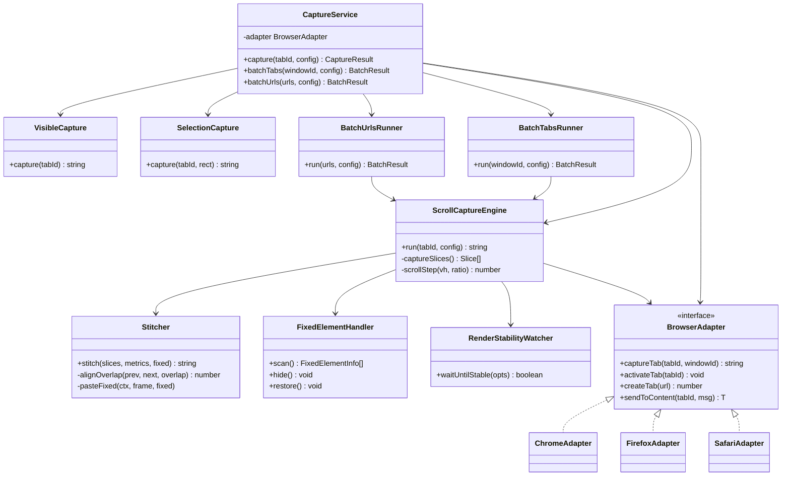
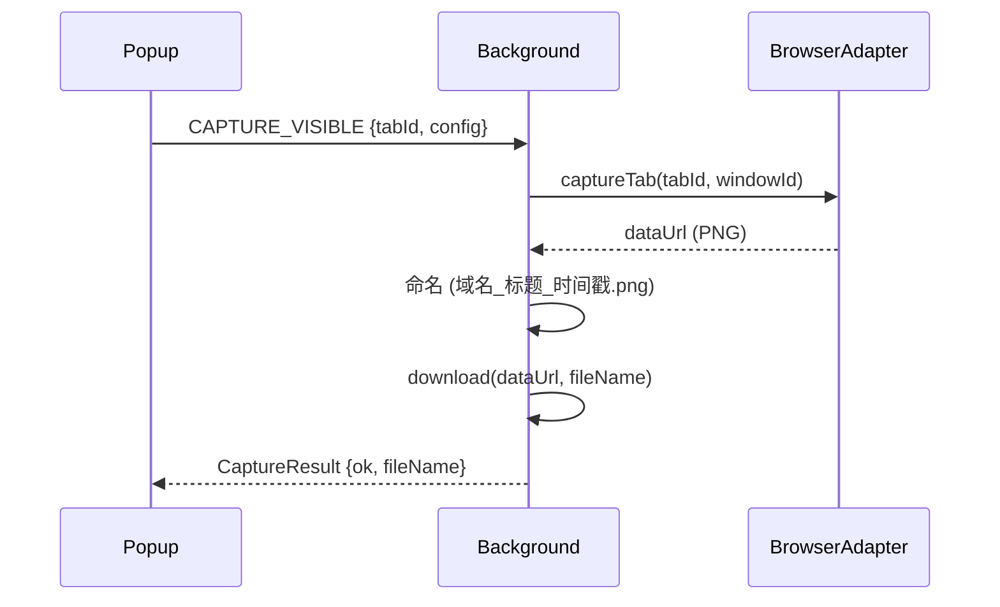
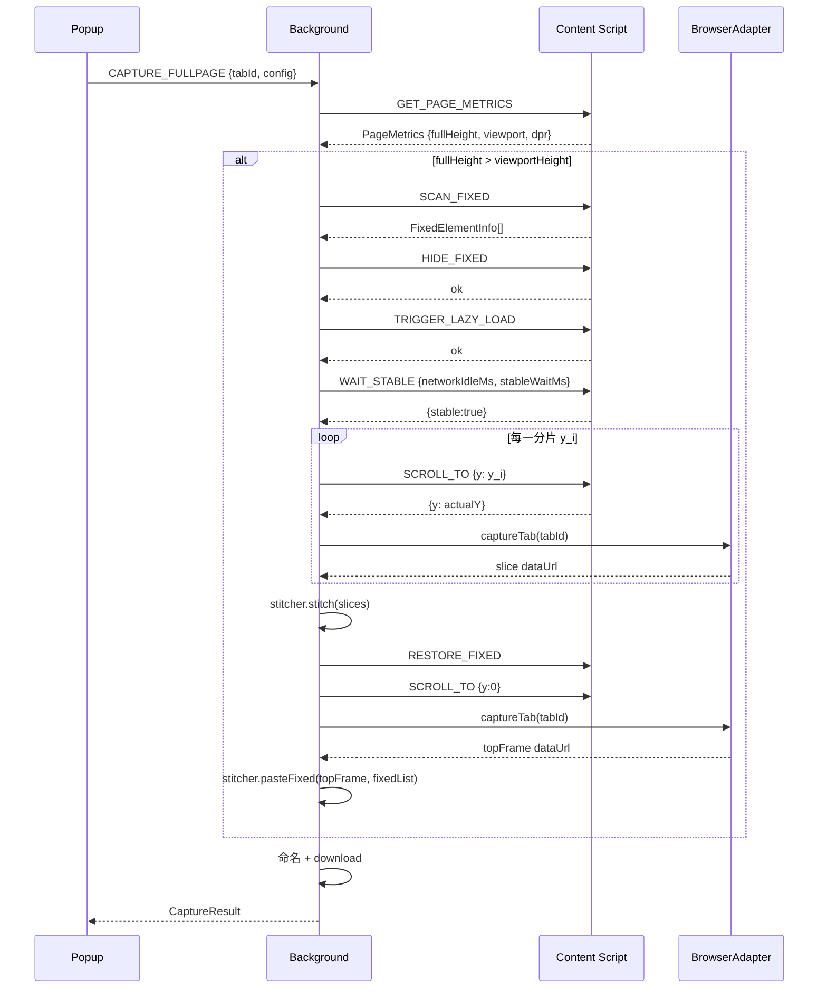
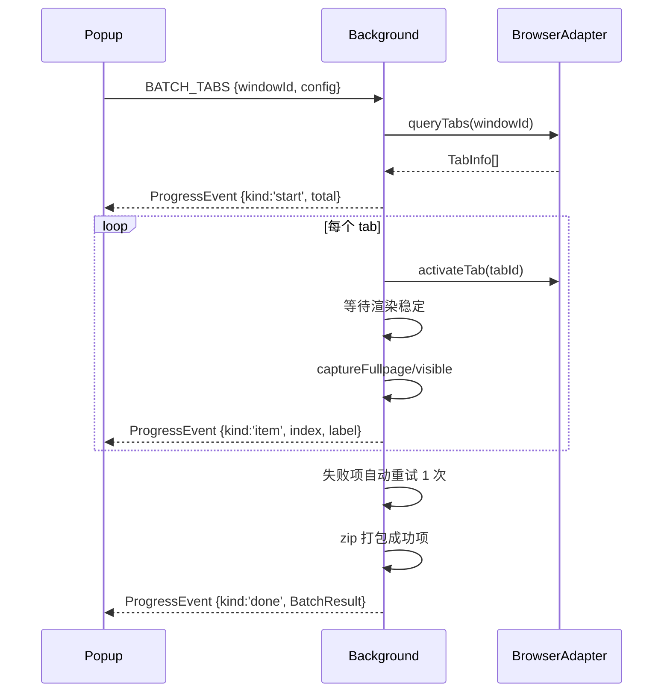
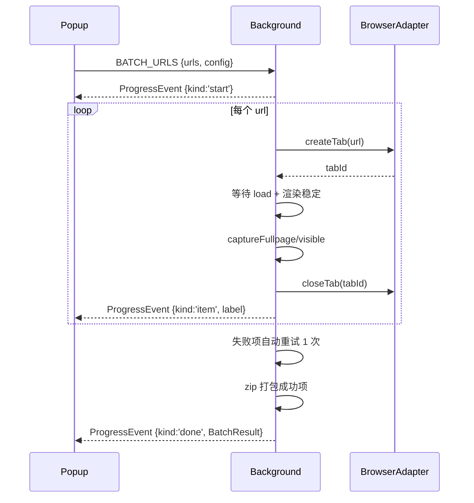
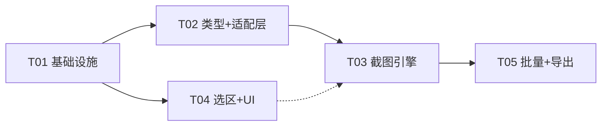

# WXT 跨浏览器截图扩展 · 系统设计 + 任务分解

> 文档类型：架构设计文档（Architecture Design）
> 作者：架构师「高见远」
> 语言：中文
> 技术栈：WXT + Vite + React + TypeScript
> 目标浏览器：Chrome（P0）、Firefox（P0）、Safari（P1 降级）

---

## 0. 关键架构决策（对应 PRD Q1–Q8）

| 问题 | 结论 | 方案一句话 |
| --- | --- | --- |
| **Q1 拼接对齐策略** | **位移对齐为主 + 重叠区局部微调**；固定元素用「滚动前隐藏 + 首帧补拍」 | 分片纵向偏移由精确 `scrollY` 决定（确定性）；重叠区内做 ±overlap 的像素差最小化微调消除亚像素抖动；fixed/sticky 全程隐藏避免重复，最后在 `scrollY=0` 补拍一帧裁剪贴回一次 |
| **Q2 异步渲染完成判定** | **网络空闲 + 固定延时兜底** | `PerformanceObserver('resource')` + `MutationObserver` 连续 `networkIdleMs` 无变化判定为空闲，随后追加可配置 `stableWaitMs` 固定延时；总时长受 `maxWaitMs` 兜底 |
| **Q3 Firefox 权限** | **接受** `<all_urls>` + `tabs` | 截图类扩展必须；在 `wxt.config.ts` 的 Firefox 目标下声明 |
| **Q4 Safari 降级边界** | **仅可见区域 + 明确提示** | 能力探测到 Safari 时禁用「整页/选定区域/按 URL 批量」入口，Popup 顶部常驻降级提示条 |
| **Q5 批量失败策略** | **跳过并标记，结束后统一重试** | 单个失败不中断，记录失败原因；全部结束后对失败项做 1 次自动重试，仍失败则展示列表 |
| **Q6 命名规则** | `域名_标题_时间戳.png` | 域名去 `www.` 与端口，标题清洗非法字符（`\/:*?"<>|` → `_`）并截断到 50 字符 |
| **Q7 选区是否超可视区** | **P0 仅可视区内框选** | 框选范围限制在 `window.innerWidth × innerHeight` 内；超可视区自动滚动扩展选区放 P2 |
| **Q8 高度上限** | **不设硬上限** | 拼接前估算长图体积，超阈值（如 4000 万物理像素）仅提示耗时，不阻断；内存优化分块放 P2 |

---

## 1. 实现方案总览 + 框架选型

### 1.1 核心难点分析

1. **整页无缝拼接**：原生 `captureVisibleTab` / `captureTab` 只能截取当前视口，无法直接产出长图。必须「精确滚动 + 逐帧捕获 + Canvas 拼接」，难点在**分片对齐**与**接缝去重**。
2. **固定定位元素重复**：`position: fixed` / `sticky` 元素随滚动始终停留在视口同一位置，逐帧拼接会导致重复出现。
3. **懒加载 / 异步内容**：`loading=lazy`、`data-src`、IntersectionObserver 触发的图片，以及滚动触发的异步渲染，会导致分片间内容不一致（缺失/重复/撕裂）。
4. **跨浏览器 API 差异**：Chrome `tabs.captureVisibleTab`（只能截激活 tab 的可见区） vs Firefox `tabs.captureTab`（可截任意 tab，需 `<all_urls>`+`tabs`） vs Safari（能力受限）。
5. **devicePixelRatio 换算**：截图返回物理像素，滚动坐标是 CSS 像素，拼接必须在统一坐标系下换算。

### 1.2 框架选型与理由

| 选型 | 理由 |
| --- | --- |
| **WXT** | 官方多浏览器构建框架，一套代码输出 Chrome/Firefox/Safari 多产物；内置 `webextension-polyfill`（`browser.*` 统一 API）、TS 类型、HMR、`import.meta.env.BROWSER` 构建目标注入 |
| **React + TypeScript** | Popup / Options 的交互 UI（模式选择、批量面板、进度条）；TS 保证消息协议与类型跨 background↔content 共享 |
| **原生 Canvas（2D）** | 拼接核心，无需额外图像库；`drawImage` + `toDataURL` 完成分片合成与编码输出 |
| **JSZip** | 批量结果打包下载（P1-2） |
| **不用 html2canvas** | PRD 明确排除 DOM 重渲染方案；原生截图保真度高、性能好 |

### 1.3 架构模式

- **整体架构**：扩展标准三层 —— **background（Service Worker，编排与权限 API 调用）/ content script（页面内 DOM 操作与滚动）/ popup+options（React UI）**，三者通过消息总线通信。
- **跨浏览器适配**：`BrowserAdapter` 接口 + 三实现（Chrome/Firefox/Safari）+ 工厂方法 + 能力探测（Adapter 模式）。
- **截图引擎**：`CaptureService` 作为统一入口，按 `CaptureMode` 分发到 `VisibleCapture` / `ScrollCapture` / `SelectionCapture`，`Stitcher` 独立负责 Canvas 拼接。
- **批量任务**：`BatchTabsRunner` / `BatchUrlsRunner` 实现遍历、等待、重试、进度回调。

### 1.4 WXT entrypoints 模型

| Entrypoint | 目录/文件 | 运行环境 | 职责 |
| --- | --- | --- | --- |
| background | `entrypoints/background.ts` | Service Worker（MV3）/ Background Page（MV2） | 消息路由、截图编排、跨浏览器 API 调用、批量任务 |
| content script | `entrypoints/content.ts` | 页面顶层 frame | 精确滚动、页面度量、fixed 元素隐藏/恢复、懒加载触发、稳定等待、选区 overlay |
| popup | `entrypoints/popup/` | 弹窗 UI | 三种截图模式入口、批量面板、进度、下载、设置入口 |
| options | `entrypoints/options/` | 设置页 UI | 滚动步长、重叠比例、等待时长、输出格式等配置 |

WXT 通过 `entrypoints/` 目录约定自动识别 entrypoint 类型（文件名即类型）；content script 通过 `wxt.config.ts` 的 `manifest.content_scripts` 配置匹配 `matches: ['<all_urls>']` 与 `run_at`。

### 1.5 多浏览器构建配置（wxt.config.ts 要点）

```ts
// wxt.config.ts（示意，具体由工程师实现）
import { defineConfig } from 'wxt';
import react from '@wxt-dev/module-react';

export default defineConfig({
  modules: [react()],
  srcDir: '.',
  manifest: {
    name: 'WXT 截图扩展',
    permissions: ['tabs', 'activeTab', 'downloads', 'storage', '<all_urls>'],
    host_permissions: ['<all_urls>'],          // MV3 Chrome
    content_scripts: [{ matches: ['<all_urls>'], js: ['content-scripts/content.js'], run_at: 'document_idle' }],
  },
});
```

- 构建命令：`wxt build -b chrome-mv3` / `-b firefox-mv2` / `-b safari-mv3`（Safari 由 Xcode 项目签名，WXT 生成项目壳）。
- **权限差异**：Firefox 的 `captureTab` 额外需要 `tabs` + `<all_urls>`（Q3 已确认接受）；Chrome 用 `activeTab` 覆盖单页截图，`<all_urls>` 覆盖按 URL 批量；Safari 需要显式 `tabs` 权限声明（降级场景）。
- `import.meta.env.BROWSER` / `import.meta.env.CHROME` / `import.meta.env.FIREFOX` / `import.meta.env.SAFARI` 供运行时能力探测。

---

## 2. 完整文件列表

> 相对项目根目录 `wxt-screenshot/`。每文件一句话职责说明。

```
wxt-screenshot/
├── package.json                      # 依赖声明 + 脚本（dev/build/zip）
├── tsconfig.json                     # TS 编译配置（WXT 推荐配置 + path 别名 @/）
├── wxt.config.ts                     # WXT 配置：多浏览器 target、manifest 权限、React 模块
├── .gitignore                        # 忽略 node_modules / .output / .wxt
├── README.md                         # 项目说明与开发/构建/调试指引
│
├── entrypoints/
│   ├── background.ts                 # 后台入口：注册消息路由、调用 CaptureService 与 BatchRunner
│   ├── content.ts                    # content script 入口：注册来自 background 的消息处理器（薄壳）
│   ├── popup/
│   │   ├── index.html                # popup 挂载页
│   │   ├── main.tsx                  # React 挂载入口
│   │   ├── App.tsx                   # popup 主面板：模式选择 + 批量 + 结果 + 设置入口
│   │   ├── style.css                 # popup 样式
│   │   └── components/
│   │       ├── ModeSelector.tsx      # 三种截图模式单选组件
│   │       ├── BatchPanel.tsx        # 按选项卡 / 按 URL 批量面板
│   │       └── ProgressBar.tsx       # 批量进度与失败重试展示组件
│   └── options/
│       ├── index.html                # options 挂载页
│       ├── main.tsx                  # React 挂载入口
│       └── App.tsx                   # 设置表单：步长/重叠/等待/格式
│
├── core/                             # 截图引擎（background 端，部分模块在 content 端运行）
│   ├── capture-service.ts            # 统一入口：按模式分发 + 结果命名 + 错误处理
│   ├── visible-capture.ts            # 可见区域截图（含 DPR 尺寸计算）
│   ├── scroll-capture.ts             # 整页滚动截图流程编排（滚动→截图→拼接→补拍 fixed）
│   ├── stitch.ts                     # Canvas 拼接器：分片对齐、重叠微调、fixed 贴回
│   ├── selection-capture.ts          # 选区截图：可见截图 + 按 rect 裁剪
│   ├── batch-tabs.ts                 # 按选项卡批量：遍历→激活→等待→截图→汇总重试
│   ├── batch-urls.ts                 # 按 URL 批量：打开→加载等待→截图→关闭→汇总重试
│   └── content/                      # content script 端模块（在页面内运行）
│       ├── scroll.ts                 # 精确滚动（整像素）与页面度量采集
│       ├── fixed-elements.ts         # fixed/sticky 元素扫描、隐藏、恢复、rect 记录
│       ├── lazy-load.ts              # 懒加载触发与图片解码等待
│       ├── stable-wait.ts            # 网络空闲 + DOM 稳定 + 固定延时兜底判定
│       └── overlay.ts                # 选区遮罩层：拖拽框选、尺寸显示、Esc/回车交互
│
├── adapters/                         # 跨浏览器截图 API 适配层（Adapter 模式）
│   ├── browser-adapter.ts            # BrowserAdapter 接口 + 工厂函数 createAdapter()
│   ├── chrome-adapter.ts             # chrome.tabs.captureVisibleTab 实现
│   ├── firefox-adapter.ts            # browser.tabs.captureTab 实现
│   └── safari-adapter.ts             # Safari 降级：仅可见区域实现
│
├── utils/
│   ├── capabilities.ts               # 运行时能力探测（canScrollCapture/canFullpage/...）
│   ├── naming.ts                     # 文件名生成（域名_标题_时间戳.png）+ 非法字符清洗
│   ├── storage.ts                    # 配置读写（browser.storage.sync/local）+ 默认值
│   ├── zip.ts                        # JSZip 打包截图集
│   ├── download.ts                   # browser.downloads.download 封装（dataURL → 文件）
│   └── logger.ts                     # 统一日志（带模块前缀，debug 可开关）
│
└── types/
    ├── capture.ts                    # 截图模式/结果/分片/页面度量等类型
    ├── config.ts                     # 配置项与默认值类型
    └── messages.ts                   # background↔content↔popup 消息协议类型
```

---

## 3. 数据结构和接口定义

### 3.1 截图核心类型（`types/capture.ts`）

```ts
export type CaptureMode = 'visible' | 'area' | 'fullpage';

export type OutputFormat = 'png' | 'jpeg';

export interface Rect {
  x: number;      // CSS px，相对视口/页面左上角
  y: number;
  width: number;
  height: number;
}

/** 页面度量（content script 采集，CSS px + DPR） */
export interface PageMetrics {
  viewportWidth: number;     // window.innerWidth
  viewportHeight: number;    // window.innerHeight
  fullWidth: number;         // document.scrollingElement.scrollWidth
  fullHeight: number;        // document.scrollingElement.scrollHeight
  devicePixelRatio: number;  // window.devicePixelRatio
  scrollY: number;           // 当前滚动位置
}

/** 固定/粘性元素信息（滚动前扫描记录） */
export interface FixedElementInfo {
  index: number;
  tagName: string;
  position: 'fixed' | 'sticky';
  rect: Rect;                // scrollY=0 时 getBoundingClientRect()（CSS px，相对视口）
  id?: string;
  className?: string;
}

/** 单个滚动分片 */
export interface Slice {
  index: number;
  scrollY: number;           // 该分片对应的页面滚动位置（CSS px，整数）
  dataUrl: string;           // 原生截图 dataURL
  width: number;             // 物理像素宽
  height: number;            // 物理像素高
}

/** 单次截图结果 */
export interface CaptureResult {
  ok: boolean;
  mode: CaptureMode;
  fileName?: string;
  dataUrl?: string;          // 最终结果（整页/可见/选区）
  tabId?: number;
  url?: string;
  title?: string;
  error?: string;            // 失败原因
  retried?: boolean;         // 是否已自动重试
}

/** 批量截图汇总 */
export interface BatchResult {
  total: number;
  success: number;
  failed: number;
  items: CaptureResult[];
}
```

### 3.2 配置类型（`types/config.ts`）

```ts
export interface CaptureConfig {
  mode: CaptureMode;
  format: OutputFormat;
  quality: number;            // jpeg 质量 0~1，png 忽略
  overlapRatio: number;       // 相邻分片重叠区比例 0~0.3，默认 0.15
  networkIdleMs: number;      // 网络空闲判定窗口，默认 500
  stableWaitMs: number;       // 空闲后追加固定延时兜底，默认 800
  maxWaitMs: number;          // 单页等待总上限，默认 15000
  handleFixed: boolean;       // 是否处理 fixed/sticky，默认 true
  triggerLazyLoad: boolean;   // 是否触发懒加载，默认 true
  maxHeight: number | null;   // 高度上限，null=不设硬上限
}

export const DEFAULT_CONFIG: CaptureConfig = {
  mode: 'fullpage',
  format: 'png',
  quality: 0.92,
  overlapRatio: 0.15,
  networkIdleMs: 500,
  stableWaitMs: 800,
  maxWaitMs: 15000,
  handleFixed: true,
  triggerLazyLoad: true,
  maxHeight: null,
};
```

### 3.3 消息协议（`types/messages.ts`）

```ts
// ---- background → content script ----
export type ContentRequest =
  | { type: 'SCROLL_TO';        payload: { y: number } }                 // 精确滚动到 y（CSS px）
  | { type: 'GET_PAGE_METRICS'; payload: Record<string, never> }         // 采集页面度量
  | { type: 'SCAN_FIXED';       payload: Record<string, never> }         // 扫描 fixed/sticky
  | { type: 'HIDE_FIXED';       payload: Record<string, never> }         // 隐藏 fixed/sticky
  | { type: 'RESTORE_FIXED';    payload: Record<string, never> }         // 恢复 fixed/sticky
  | { type: 'TRIGGER_LAZY_LOAD';payload: Record<string, never> }         // 触发懒加载并等待图片
  | { type: 'WAIT_STABLE';      payload: { networkIdleMs: number; stableWaitMs: number; maxWaitMs: number } }
  | { type: 'START_SELECTION';  payload: Record<string, never> }         // 进入选区模式
  | { type: 'CANCEL_SELECTION'; payload: Record<string, never> };        // 取消选区

// ---- content script → background（响应） ----
export type ContentResponse<T = unknown> =
  | { ok: true;  data: T }
  | { ok: false; error: string };

export type ContentResponseData =
  | PageMetrics
  | FixedElementInfo[]
  | { stable: boolean; elapsedMs: number }
  | Rect                // 选区结果
  | { restored: number } // 恢复的 fixed 元素数
  | { y: number };       // 滚动后实际 scrollY

// ---- popup/options → background ----
export type PopupRequest =
  | { type: 'CAPTURE_VISIBLE';  payload: { tabId: number; config: CaptureConfig } }
  | { type: 'CAPTURE_FULLPAGE'; payload: { tabId: number; config: CaptureConfig } }
  | { type: 'CAPTURE_AREA';     payload: { tabId: number; rect: Rect; config: CaptureConfig } }
  | { type: 'BATCH_TABS';       payload: { windowId: number; config: CaptureConfig } }
  | { type: 'BATCH_URLS';       payload: { urls: string[]; config: CaptureConfig } }
  | { type: 'GET_PROGRESS';     payload: Record<string, never> }
  | { type: 'GET_CONFIG';       payload: Record<string, never> }
  | { type: 'SET_CONFIG';       payload: Partial<CaptureConfig> };

// ---- background → popup（进度/结果推送） ----
export type ProgressEvent =
  | { kind: 'start';   total: number }
  | { kind: 'item';    index: number; total: number; label: string }
  | { kind: 'done';    result: BatchResult };
```

### 3.4 浏览器适配接口（`adapters/browser-adapter.ts`）

```ts
export interface TabInfo {
  id: number;
  windowId: number;
  url?: string;
  title?: string;
  active: boolean;
}

export interface Capabilities {
  name: 'chrome' | 'firefox' | 'safari';
  canCaptureVisible: boolean;
  canScrollCapture: boolean;     // 是否支持整页滚动拼接
  canAreaSelection: boolean;
  canBatchTabs: boolean;
  canBatchUrls: boolean;
  captureNeedsActiveTab: boolean; // Chrome true / Firefox false
}

export interface BrowserAdapter {
  readonly name: 'chrome' | 'firefox' | 'safari';
  readonly capabilities: Capabilities;
  /** 截取指定 tab 的可见区域，返回 PNG dataURL */
  captureTab(tabId: number, windowId?: number): Promise<string>;
  activateTab(tabId: number): Promise<void>;
  createTab(url: string): Promise<number>;
  closeTab(tabId: number): Promise<void>;
  queryTabs(windowId?: number): Promise<TabInfo[]>;
  /** 向 tab 发送 content 消息并等待响应 */
  sendToContent<T>(tabId: number, msg: ContentRequest): Promise<ContentResponse<T>>;
}
```

### 3.5 核心服务类关系（Mermaid classDiagram）



---

## 4. 核心算法设计

> 本节为项目技术命脉，给出可直接照实现的方案。

### 4.1 整页滚动截图总流程

```
captureFullPage(tabId, config):
  1. metrics = sendToContent(tabId, GET_PAGE_METRICS)        # 视口/总高/DPR
  2. if metrics.fullHeight <= metrics.viewportHeight:
       return visibleCapture(tabId)                          # 单屏直接截
  3. fixedList = sendToContent(tabId, SCAN_FIXED)            # 扫描 fixed/sticky 记录 rect
  4. sendToContent(tabId, HIDE_FIXED)                        # 隐藏，避免滚动重复
  5. if config.triggerLazyLoad:
       sendToContent(tabId, TRIGGER_LAZY_LOAD)               # 触发懒加载 + 等图片 decode
  6. sendToContent(tabId, WAIT_STABLE, config)               # 网络空闲 + 固定延时
  7. slices = captureSlices(tabId, metrics, config)          # 逐片滚动截图（见 4.2）
  8. dataUrl = stitcher.stitch(slices, metrics)              # Canvas 拼接（见 4.4）
  9. sendToContent(tabId, RESTORE_FIXED)                     # 恢复 fixed
  10. sendToContent(tabId, SCROLL_TO, { y: 0 })              # 回到顶部
  11. topFrame = adapter.captureTab(tabId)                   # 补拍首帧
  12. dataUrl = stitcher.pasteFixed(dataUrl, topFrame, fixedList, metrics)  # 贴回 fixed 一次
  13. return dataUrl
```

### 4.2 滚动步长计算与分片捕获（`scroll.ts` / `scroll-capture.ts`）

```
scrollStep(vh, overlapRatio):
    return max(1, floor(vh * (1 - overlapRatio)))     # CSS px，整数

buildPositions(vh, total, step):
    positions = []
    y = 0
    while y < total - vh:
        positions.push(y)
        y += step
    positions.push(total - vh)                        # 末片对齐到底部
    return dedupe(positions)                          # 去重相邻相等

captureSlices(tabId, metrics, config):
    step = scrollStep(metrics.viewportHeight, config.overlapRatio)
    for (i, y) in buildPositions(...):
        actualY = sendToContent(tabId, SCROLL_TO, { y })    # window.scrollTo(0, y)
        await sleep(config.stableWaitMs)                     # 每片滚动后等待渲染（触发懒加载）
        dataUrl = adapter.captureTab(tabId)                  # 原生截图
        slices.push({ index: i, scrollY: actualY, dataUrl, ... })
    return slices
```

**关键点：**
- 滚动用 `window.scrollTo(0, y)` 且 `y` 为整数，保证无亚像素；返回 `window.scrollY` 实测值作为 `scrollY`（滚动条到底时可能与目标 y 有偏差，以实测为准）。
- 重叠区 = `viewportHeight - step = ceil(vh * overlapRatio)`，是拼接时对齐的"冗余带"。

### 4.3 重叠区对齐（位移为主 + 局部微调，`stitch.ts`）

```
stitch(slices, metrics):
    dpr = metrics.devicePixelRatio
    canvas = new Canvas(round(fullWidth*dpr), round(fullHeight*dpr))
    ctx = canvas.getContext('2d')
    prev = null
    for slice in slices:
        img = await loadImage(slice.dataUrl)
        if prev == null:
            ctx.drawImage(img, 0, round(slice.scrollY * dpr))   # 首片按位移精确放置
        else:
            # 位移对齐基线：y = round(slice.scrollY * dpr)
            delta = alignOverlap(prev, img, overlapPx, yBase)   # 重叠区局部微调
            ctx.drawImage(img, 0, yBase + delta)
        prev = img
    return canvas.toDataURL(config.format, config.quality)

alignOverlap(prev, cur, overlapPx, yBase):
    # 在重叠带内竖直滑动 cur，找 SSD（像素差平方和）最小的偏移
    bestDelta = 0; bestCost = +inf
    for delta in -overlapPx .. +overlapPx:                      # 搜索 ±重叠区
        cost = sumOverOverlapBand(prev, cur, overlapPx, yBase, delta)
        if cost < bestCost: bestCost = cost; bestDelta = delta
    return bestDelta
```

**对齐策略说明（Q1）：**
- **主对齐**：确定性位移 —— 分片在长图中的物理 y 坐标 = `round(scrollY × dpr)`，不依赖图像特征匹配，天然规避"找不到特征点"的失效场景。
- **微调**：仅在重叠带内做 ±overlap 的竖直滑动，用最小 SSD 校正亚像素误差、`scrollY` 舍入误差与滚动期间异步内容抖动造成的 1~2px 接缝。微调是"锦上添花"的鲁棒性增强，P0 若时间紧张可先退化为纯位移对齐（`delta=0`）。

### 4.4 devicePixelRatio 与坐标换算规范

| 量 | 坐标系 | 说明 |
| --- | --- | --- |
| `scrollY` / `rect` / `viewportWidth/Height` | CSS px | 来自 DOM，整数或精确小数 |
| 截图 dataURL 图片尺寸 | 物理像素 | `round(viewportCSS × dpr)` |
| Canvas 尺寸 | 物理像素 | `round(fullWidth×dpr) × round(fullHeight×dpr)` |
| 分片绘制位置 | 物理像素 | `round(slice.scrollY × dpr)` |
| fixed 补拍裁剪/贴回 | 物理像素 | `rect.* × dpr` |
| 选区裁剪 | 物理像素 | 源坐标 `rect.* × dpr`，目标尺寸 `round(rect.w×dpr) × round(rect.h×dpr)` |

> 统一用 `Math.round()` 取整物理像素坐标，避免 `drawImage` 落在小数坐标引发抗锯齿半透明/模糊。`dpr` 若为 1.25/1.5 等非整数，务必先 round 再绘制。

### 4.5 固定/粘性元素处理（`fixed-elements.ts`）

```
scan():
    list = []
    for el in document.querySelectorAll('*'):
        cs = getComputedStyle(el)
        if cs.position == 'fixed' or cs.position == 'sticky':
            rect = el.getBoundingClientRect()     # scrollY=0 时的初始位置
            if rect.width>0 and rect.height>0:
                el.dataset.__wxtFixedIdx = list.length
                list.push({ index, tagName, position, rect, ... })
    return list

hide():
    for el in markedElements:
        el.dataset.__wxtPrevVisibility = el.style.visibility
        el.style.visibility = 'hidden'           # 保留占位（避免布局抖动），仅隐藏像素

restore():
    for el in markedElements:
        el.style.visibility = el.dataset.__wxtPrevVisibility || ''
        delete el.dataset.__wxtPrevVisibility
        delete el.dataset.__wxtFixedIdx
```

**贴回（pasteFixed）——"只出现一次"的确定性实现：**

```
pasteFixed(longCanvas, topFrameImg, fixedList, metrics):
    dpr = metrics.devicePixelRatio
    for f in fixedList:
        src = f.rect                                   # 相对视口（scrollY=0 帧）
        # 从补拍的 topFrame 裁剪 fixed 元素区域，贴到长图同坐标（物理像素）
        ctx.drawImage(
            topFrameImg,
            round(src.x*dpr), round(src.y*dpr), round(src.width*dpr), round(src.height*dpr),
            round(src.x*dpr), round(src.y*dpr), round(src.width*dpr), round(src.height*dpr)
        )
```

**原理**：滚动阶段全程隐藏 fixed/sticky，拼接出的长图"纯净无重复"；补拍阶段回到顶部截一帧，该帧中 fixed/sticky 处于其初始（scrollY=0）视觉位置，按 `rect` 裁剪贴回长图一次。因此 fixed 导航栏出现在页面顶部、只出现一次，视觉正确。

> **已知边界**：`sticky` 元素真实行为是"滚动到容器范围内吸顶"，本方案简化为"初始位置出现一次、其余滚动过程隐藏"。P0 接受该简化（绝大多数 sticky 吸顶栏语义等同 fixed 头部）；需要像素级还原 sticky 吸附轨迹的增强放 P2。

### 4.6 懒加载图片触发（`lazy-load.ts`）

```
triggerLazyLoad():
    prevY = window.scrollY
    scrollTo(0, document.scrollingElement.scrollHeight)   # 快速滚到底，触发 IO/loading=lazy
    await nextFrame()
    scrollTo(0, prevY)                                     # 滚回原位
    await nextFrame()

    for img of document.images:
        if img.dataset.src  && !img.src: img.src = img.dataset.src
        if img.dataset.original && !img.src: img.src = img.dataset.original
        if img.getAttribute('loading') == 'lazy': img.loading = 'eager'
        img.loading = 'eager'

    await Promise.all([...document.images].map(async img => {
        if (img.complete) return
        await img.decode().catch(() => {})                 # 触发解码并等待
    }))
```

> CSS `background-image` 懒加载（如 `data-bg` 属性）无法遍历枚举，依赖"快速滚一遍"触发 IntersectionObserver；已滚动过的区域图片会进入加载队列，配合 `WAIT_STABLE` 等待其完成。

### 4.7 异步渲染完成判定（`stable-wait.ts`，Q2）

```
waitUntilStable({ networkIdleMs, stableWaitMs, maxWaitMs }):
    start = now(); lastActivity = now()
    resObs = new PerformanceObserver(list => lastActivity = now())
    resObs.observe({ type: 'resource', buffered: true })        # 任一资源请求即刷新时间戳
    mo = new MutationObserver(() => lastActivity = now())
    mo.observe(document.body, { childList: true, subtree: true, attributes: true })

    while now() - start < maxWaitMs:
        if now() - lastActivity >= networkIdleMs: break          # 连续 networkIdleMs 无资源/DOM 变化
        await sleep(100)
    await sleep(stableWaitMs)                                    # 固定延时兜底
    resObs.disconnect(); mo.disconnect()
    return { stable: true, elapsedMs: now() - start }
```

**判定标准**：`PerformanceObserver('resource')` 监控网络资源 + `MutationObserver` 监控 DOM 变化，二者任一触发即刷新"最后活动时间"；连续 `networkIdleMs` 无活动视为空闲；随后追加 `stableWaitMs` 固定延时兜底；总时长受 `maxWaitMs` 上限保护，超时按"已尽力"继续截图（不阻塞，避免死等）。

### 4.8 跨浏览器适配层（Adapter 模式）

```ts
// adapters/browser-adapter.ts
export function createAdapter(): BrowserAdapter {
  const name = import.meta.env.BROWSER;          // WXT 注入：'chrome'|'firefox'|'safari'
  switch (name) {
    case 'firefox': return new FirefoxAdapter();
    case 'safari':  return new SafariAdapter();
    default:        return new ChromeAdapter();
  }
}
```

| 能力 | Chrome | Firefox | Safari |
| --- | --- | --- | --- |
| 截可见区 API | `chrome.tabs.captureVisibleTab(windowId, {format:'png'})` | `browser.tabs.captureTab(tabId, {format:'png'})` | `browser.tabs.captureVisibleTab(windowId)` |
| 能否截非激活 tab | 否（必须激活） | **是**（`captureTab` 支持） | 否 |
| 整页滚动拼接 | 支持 | 支持 | 降级（不启用） |
| 所需权限 | `activeTab`/`<all_urls>`+`tabs` | `<all_urls>`+`tabs` | `<all_urls>`+`tabs` |

```ts
// firefox-adapter.ts 核心差异点
async captureTab(tabId: number): Promise<string> {
  // Firefox 独有 API：可截后台 tab；返回 dataUrl 可能不含前缀，需补 'data:image/png;base64,'
  const dataUrl = await browser.tabs.captureTab(tabId, { format: 'png' });
  return dataUrl.startsWith('data:') ? dataUrl : `data:image/png;base64,${dataUrl}`;
}
```

- **能力探测**：`capabilities.ts` 依据 `import.meta.env.BROWSER` 输出 `Capabilities`；Safari 下 `canScrollCapture=false`、`canAreaSelection=false`、`canBatchUrls=false`，`canCaptureVisible=true`、`canBatchTabs=true`（按选项卡批量降级为逐个可见截图）。
- **降级提示（Q4）**：Safari 时 Popup 顶部显示"当前浏览器仅支持可见区域截图"，整页/选区/按 URL 批量入口置灰。

---

## 5. 程序调用流程（时序图）

### 5.1 可见区域截图



### 5.2 整页滚动截图（核心链路）



### 5.3 按选项卡批量截图



### 5.4 按 URL 列表批量截图



---

## 6. 任务列表（有序，含依赖）

> 硬约束：≤5 个任务，每任务 ≥3 文件，T01 为项目基础设施。

| 任务 | 名称 | 涉及文件 | 依赖 | 优先级 | 验收标准 |
| --- | --- | --- | --- | --- | --- |
| **T01** | 项目基础设施 + 三入口骨架 | `package.json`、`tsconfig.json`、`wxt.config.ts`、`.gitignore`、`README.md`、`entrypoints/background.ts`、`entrypoints/content.ts`、`entrypoints/popup/{index.html,main.tsx,App.tsx,style.css}`、`entrypoints/options/{index.html,main.tsx,App.tsx}` | — | P0 | `wxt build -b chrome-mv3/firefox-mv2/safari-mv3` 三目标均构建通过；popup/options 可打开显示占位 UI；background 可响应 popup 的 `GET_CONFIG` 心跳 |
| **T02** | 类型定义 + 跨浏览器适配层 + 工具 | `types/{capture,config,messages}.ts`、`adapters/{browser-adapter,chrome-adapter,firefox-adapter,safari-adapter}.ts`、`utils/{capabilities,naming,storage,logger}.ts` | T01 | P0 | `createAdapter()` 按 `BROWSER` 返回正确实现；`capabilities` 三浏览器探测正确；`naming` 生成 `域名_标题_时间戳.png` 且非法字符清洗通过；`storage` 读写配置 + 默认值回退 |
| **T03** | 截图引擎（可见 + 整页滚动拼接）+ 内容脚本辅助 | `core/{capture-service,visible-capture,scroll-capture,stitch}.ts`、`core/content/{scroll,fixed-elements,lazy-load,stable-wait}.ts`、`entrypoints/content.ts`（接入消息） | T02 | P0 | 单标签可见截图尺寸与视口一致；整页截图接缝无错位/无重复/无缺失；fixed 导航栏只出现一次；懒加载图片完整加载；`dpr≠1` 下坐标换算正确 |
| **T04** | 选区截图 + Popup/Options UI 完善 | `core/selection-capture.ts`、`core/content/overlay.ts`、`entrypoints/popup/**`（完整）、`entrypoints/options/**`（完整） | T01 | P0 | 拖拽框选 + 实时尺寸 + Esc/回车交互；选区按 rect 精确裁剪；popup 三种模式可触发对应链路；options 配置保存并生效（步长/重叠/等待/格式） |
| **T05** | 批量截图 + 导出打包 + 集成联调 | `core/{batch-tabs,batch-urls}.ts`、`utils/{zip,download}.ts`、`entrypoints/popup/components/{ModeSelector,BatchPanel,ProgressBar}.tsx` | T03 | P0 | 按选项卡批量自动切页并汇总；按 URL 批量等待渲染完成后截图并关闭 tab；单失败跳过并标记、结束自动重试 1 次；进度条实时刷新；Zip 打包下载；Safari 降级提示生效 |

### 任务依赖图



> T04（UI/选区）仅依赖 T01，可与 T02/T03 并行推进；T04 与 T03 之间的虚线依赖仅在于联调时共享类型，非阻塞。

---

## 7. 依赖包列表

```jsonc
{
  "dependencies": {
    "react": "^18.3.1",                    // Popup/Options UI
    "react-dom": "^18.3.1",                // React 渲染
    "jszip": "^3.10.1"                     // 批量截图 Zip 打包（P1-2）
    // webextension-polyfill 由 WXT 自动注入，无需显式声明
  },
  "devDependencies": {
    "wxt": "^0.19.0",                      // WXT 框架（构建/多浏览器/HMR）
    "typescript": "^5.5.0",                // TS 编译
    "@types/react": "^18.3.0",             // React 类型
    "@types/react-dom": "^18.3.0",         // ReactDOM 类型
    "@wxt-dev/module-react": "^1.0.0",     // WXT React 模块（HMR 集成）
    "vite": "^5.4.0"                       // 底层构建器（WXT 依赖）
  }
}
```

> 版本号以安装时 npm 最新稳定版为准；`jszip` 用于 `utils/zip.ts`，`browser.downloads.download` 用于 `utils/download.ts`。

---

## 8. 共享知识（跨文件约定）

- **消息命名约定**：background↔content 用 `SCREAMING_SNAKE_CASE`（`SCROLL_TO`、`GET_PAGE_METRICS`、`WAIT_STABLE`）；popup↔background 同样用大写动词开头（`CAPTURE_VISIBLE`、`BATCH_TABS`）。所有消息统一为判别联合（discriminated union，`type` 字段区分），禁止魔法字符串散落。
- **错误处理约定**：content 响应统一 `{ ok: true, data } | { ok: false, error }`；background 捕获异常后转 `CaptureResult { ok:false, error }` 返回，不向 popup 抛未捕获异常；批量单失败不中断，记录 `error` 供重试与展示。
- **浏览器能力探测约定**：一切跨浏览器差异收敛到 `adapters/` 与 `utils/capabilities.ts`，业务代码只依赖 `BrowserAdapter` 接口与 `Capabilities` 字段，禁止在 `core/` 里散落 `import.meta.env.CHROME` 之类的判断。
- **类型共享方式**：`types/` 为纯类型模块（不产生运行时代码），background、content、popup 三端共用；路径别名 `@/` 映射到项目根，统一 `import type { CaptureConfig } from '@/types/config'`。
- **坐标与像素约定**：DOM 侧一律 CSS px（整数滚动）；图像/Canvas 侧一律物理像素；换算统一 `Math.round(x * dpr)`。文件名生成统一走 `utils/naming.ts`，禁止各处手写。
- **配置持久化**：配置存 `browser.storage.sync`（跨设备）+ 内存缓存；读取缺省回退 `DEFAULT_CONFIG`；`SET_CONFIG` 后即时刷新后台运行配置。
- **日志**：统一 `utils/logger.ts` 带模块前缀，`debug` 级别由 storage 开关控制，便于排查滚动/拼接问题。

---

## 9. 待明确事项（含建议默认值）

| # | 待明确点 | 建议默认值 | 影响 |
| --- | --- | --- | --- |
| 1 | `sticky` 元素是否需像素级还原"吸附轨迹" | P0 简化为"初始位置出现一次"，P2 增强 | 整页截图对吸顶栏的还原精度 |
| 2 | 重叠区微调（SSD 对齐）是否 P0 必做 | P0 先做纯位移对齐，微调作为 P1 优化项 | 接缝鲁棒性 vs 实现成本 |
| 3 | 超长页面（>2 万物理像素）内存风险 | 不设硬上限，超过阈值仅提示耗时；分块拼接放 P2 | 性能/内存 |
| 4 | Safari 截图 `captureVisibleTab` 具体可用性需真机验证 | 若 Safari 该 API 不可用，进一步降级为「右键保存整页」引导 | Safari 功能范围 |
| 5 | 批量 URL 是否限制数量/并发 | 串行逐个，单批上限 50 条，可配置 | 稳定性/防滥用 |
| 6 | 截图结果是否写本地历史（P2-1） | P0 不落库，仅即时下载；历史放 P2 | 功能范围 |
| 7 | 半透明 fixed 元素（如毛玻璃导航）补拍合成透明度 | P0 直接按 rect 贴回（保留原 alpha），不做背景融合 | 视觉还原 |

---

*文档由架构师「高见远」产出，供工程师「顾一行」实现与 QA「钱验证」测试。*
