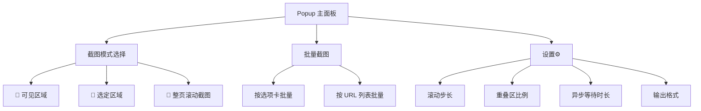
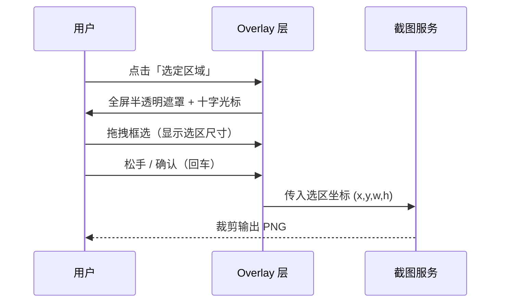

# WXT 跨浏览器截图扩展 · 产品需求文档（PRD）

> 文档类型：简单 PRD
> 语言：中文
> 技术栈：WXT 框架（Vite + React + TypeScript）
> 目标浏览器：Chrome、Firefox（P0）、Safari（P1，降级方案）

---

## 1. 项目信息

| 项目 | 内容 |
| --- | --- |
| Project Name | `wxt_screenshot` |
| 框架 | WXT（多浏览器构建，统一代码库输出多目标产物） |
| 编程语言 | TypeScript + React |
| 原始需求复述 | 基于 WXT 开发跨浏览器（Firefox/Chrome/Safari）截图扩展，支持整页滚动截图、可见区域、选定区域三种截图方案；支持按选项卡、按 URL 列表批量截图；核心是解决原生浏览器无法正确处理整页滚动截图的问题，通过「原生截图 API + 滚动拼接」实现无缝整页截图。 |

---

## 2. 产品定义

### 2.1 产品目标

1. **无缝整页截图**：用「原生截图 API + 滚动拼接」方案，生成视觉上无接缝、无重复、无缺失的完整长页面截图，解决 `html2canvas`（仅重渲染 DOM）与原生单帧截图（仅可见区域）都无法覆盖的痛点。
2. **多方案覆盖**：提供整页 / 可见区域 / 选定区域三种截图粒度，满足单页快速截取与精细化框选需求。
3. **批量效率**：支持按当前选项卡、按 URL 列表两类批量截图，自动化完成切页、等待渲染、捕获、拼接，减少人工重复操作。

### 2.2 目标用户

| 用户角色 | 典型诉求 |
| --- | --- |
| 前端开发 / QA | 快速截取整页长页面用于走查、回归对比、Bug 记录 |
| 设计师 / 产品 | 获取完整页面视觉稿，用于设计评审、还原度检查 |
| 内容运营 / 归档 | 批量截取一组 URL 页面，用于内容归档、报告素材 |

### 2.3 用户故事

| # | 用户故事 |
| --- | --- |
| US-1 | 作为开发者，我想要一键截取整个页面的滚动长截图，以便完整记录长页面的渲染效果，而不是只能看到可视区域。 |
| US-2 | 作为用户，我想要截取当前可见区域，以便快速保存当前屏幕内容，无需滚动或等待。 |
| US-3 | 作为用户，我想要用鼠标框选页面任意区域，以便精确截取我关心的局部内容。 |
| US-4 | 作为运营，我想要按当前打开的所有选项卡批量截图，以便一次性归档多个页面，省去逐页切换的重复操作。 |
| US-5 | 作为运营，我想要粘贴一组 URL 批量截图，以便对尚未打开的页面清单自动完成捕获，并在内容渲染完成后才截图。 |

---

## 3. 技术规范

### 3.1 需求池（Requirements Pool）

#### P0 — 必须实现

| ID | 需求 | 验收标准 |
| --- | --- | --- |
| P0-1 | 可见区域截图 | 调用原生 `captureVisibleTab` 等 API，输出当前可视区域 PNG，尺寸与可视区一致 |
| P0-2 | 选定区域截图 | 进入选区模式后，用户拖拽框选，按选区坐标裁剪输出 PNG |
| P0-3 | 整页滚动截图（核心） | 输出完整页面长图，接缝处无错位、无重复、无缺失 |
| P0-4 | 滚动拼接算法 | 按滚动步长截取分片，利用重叠区域做对齐/去重，无缝拼接为单张长图 |
| P0-5 | 固定定位元素处理 | 固定导航栏/头部等 fixed 元素在拼接结果中只出现一次（不随滚动重复） |
| P0-6 | 懒加载图片处理 | 滚动过程中触发懒加载，确保图片在对应分片被捕获前加载完成 |
| P0-7 | 异步内容等待 | 截图前等待页面渲染稳定（网络空闲/定时器稳定），再执行捕获 |
| P0-8 | Chrome 兼容 | 基于 `chrome.tabs.captureVisibleTab` 完整实现三种截图 + 两类批量 |
| P0-9 | Firefox 兼容 | 基于 `browser.tabs.captureTab` 完整实现三种截图 + 两类批量 |
| P0-10 | 按选项卡批量截图 | 遍历当前窗口所有选项卡，自动 `activate` 切页 → 等待 → 截取 → 汇总 |
| P0-11 | 按 URL 列表批量截图 | 输入 URL 列表，逐个打开 → 等待加载完成 → 截取 → 关闭 → 汇总 |

#### P1 — 应该实现

| ID | 需求 | 验收标准 |
| --- | --- | --- |
| P1-1 | Safari 降级方案 | Safari 无法滚动拼接时，降级为「仅可见区域截图」并明确提示用户 |
| P1-2 | 截图结果导出 | 单张保存 PNG；批量结果支持打包下载（Zip） |
| P1-3 | 配置项 | 滚动步长、重叠区比例、异步等待时长、输出格式（PNG/JPEG）可配置 |
| P1-4 | 进度反馈 | 批量截图展示进度（当前第 N 页 / 总数）与失败重试提示 |

#### P2 — 可选实现

| ID | 需求 | 验收标准 |
| --- | --- | --- |
| P2-1 | 截图历史管理 | 列表展示历史截图，支持预览、重新下载、删除 |
| P2-2 | 快捷键 | 全局快捷键触发可见区域截图 |
| P2-3 | 编辑标注 | 截图后提供简单标注（框选、箭头、文字） |
| P2-4 | 格式/质量高级配置 | 输出分辨率、JPEG 压缩质量等高级参数 |

### 3.2 UI 设计稿

#### 3.2.1 Popup 弹出页（主入口）



Popup 布局（自上而下）：

```
┌─────────────────────────────┐
│  🖼️ WXT 截图扩展            │
├─────────────────────────────┤
│  ┌─ 截图模式 ─────────────┐ │
│  │ ○ 可见区域             │ │
│  │ ○ 选定区域             │ │
│  │ ● 整页滚动截图（推荐） │ │
│  └────────────────────────┘ │
│  ┌─ 批量截图 ─────────────┐ │
│  │ [按选项卡批量截图]      │ │
│  │ [按 URL 列表批量截图]   │ │
│  └────────────────────────┘ │
│  ┌─ 结果 ─────────────────┐ │
│  │ [📥 下载 / 查看历史]    │ │
│  └────────────────────────┘ │
│  ⚙️ 设置                    │
└─────────────────────────────┘
```

#### 3.2.2 选定区域交互（截图 overlay 层）



交互要点：
- 全屏半透明遮罩（`rgba(0,0,0,0.4)`），选区高亮、区域外变暗
- 实时显示选区尺寸（宽 × 高，单位 px）
- 支持 `Esc` 取消、拖拽边缘微调、回车确认

#### 3.2.3 批量截图配置页

**按选项卡批量**：

```
┌──────────────────────────────────┐
│  按选项卡批量截图                │
├──────────────────────────────────┤
│  已检测到 8 个选项卡              │
│  [✓] 全部   [ ] 仅当前窗口       │
│  截图模式：○ 可见  ● 整页        │
│  [开始截图]                      │
│  ── 进度 ────────────────────────│
│  ████████░░ 6/8 · 正在截取 tab3  │
│  [📥 打包下载全部]               │
└──────────────────────────────────┘
```

**按 URL 列表批量**：

```
┌──────────────────────────────────┐
│  按 URL 列表批量截图             │
├──────────────────────────────────┤
│  输入 URL（每行一个）：           │
│  ┌────────────────────────────┐  │
│  │ https://example.com/a      │  │
│  │ https://example.com/b      │  │
│  │ ...                        │  │
│  └────────────────────────────┘  │
│  等待策略：○ 网络空闲 ● 固定延时  │
│  截图模式：● 整页   ○ 可见       │
│  [开始截图]                      │
│  ── 进度 ────────────────────────│
│  ✅ a.png  ❌ b(加载超时,重试)    │
│  [📥 打包下载成功项]             │
└──────────────────────────────────┘
```

---

## 4. 待确认问题（Open Questions）

| # | 问题 | 影响范围 | 建议默认值 |
| --- | --- | --- | --- |
| Q1 | 拼接重叠区对齐策略：采用「滚动位移精确对齐」还是「图像特征匹配（模板匹配）」？固定元素剔除依赖哪种？ | 整页截图质量 | 优先位移对齐，固定元素由滚动前标记 + 后期剔除 |
| Q2 | 异步内容「渲染完成」判定标准：网络空闲（`networkidle`）+ 额外延时，还是纯固定延时？ | URL 批量截图稳定性 | 网络空闲 + 可配置固定延时兜底 |
| Q3 | Firefox 的 `captureTab` 需要 `<all_urls>` 与 `tabs` 权限，是否接受该权限声明对扩展审核/安装的影响？ | 上架/安装转化 | 接受（截图类扩展必须） |
| Q4 | Safari 降级边界：Safari 是否完全放弃整页拼接，还是尝试降级实现（如分段截图拼接）？ | Safari 功能范围 | P1 仅可见区域，明确提示 |
| Q5 | 批量截图单个失败时：跳过继续 or 中止全部？ | 批量体验 | 跳过并标记失败，结束后统一重试 |
| Q6 | 输出命名规则与打包格式：`域名_时间戳.png`？Zip 内是否分目录？ | 结果归档 | `域名_标题_时间戳.png`，Zip 平铺 |
| Q7 | 选区截图是否需支持超出当前可视区的长距离拖拽（自动滚动扩展选区）？ | 选定区域功能范围 | P0 仅可视区内框选，超出滚动放 P2 |
| Q8 | 整页截图的高度上限（超长页面性能/内存）是否需要限制或分块压缩？ | 性能/内存 | 暂不设硬上限，超长页面提示耗时 |

---

## 5. 非目标（Out of Scope）

- 不实现视频录制、GIF 录制。
- 不做云端同步/账号体系。
- 不依赖 `html2canvas` 等 DOM 重渲染方案。
- 不承诺 Safari 完整整页拼接（P1 仅降级可见区域）。

---

*文档由产品经理「许清楚」产出，供架构师与研发评审。*
