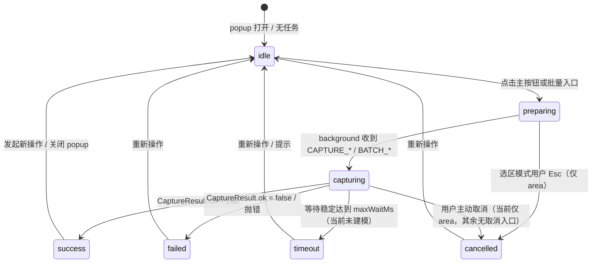
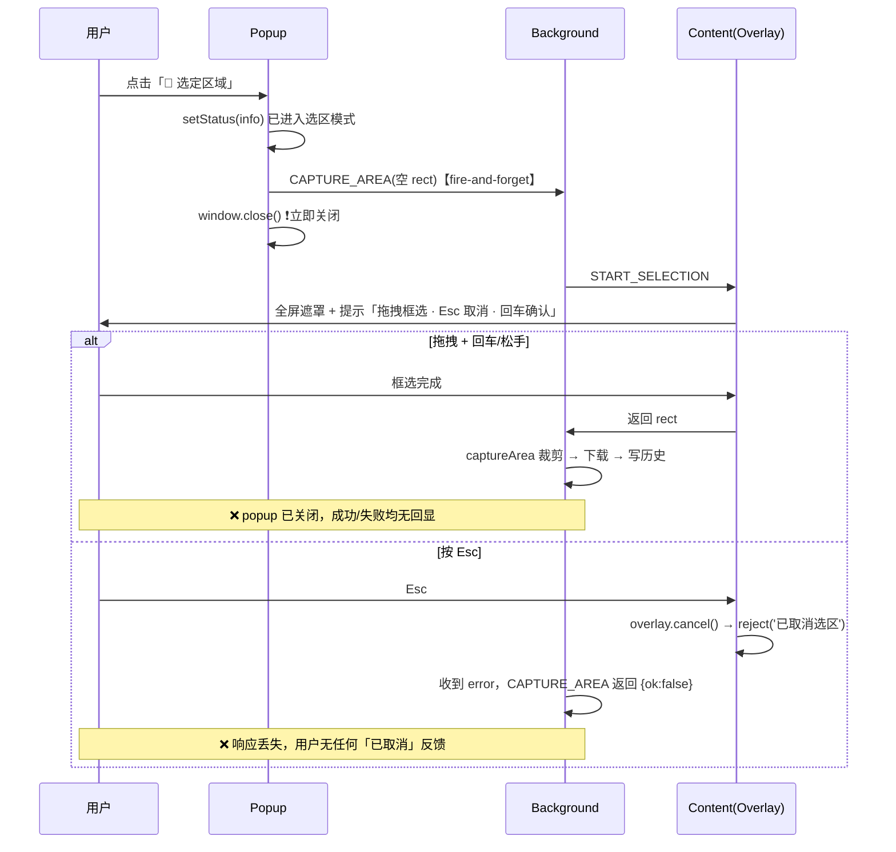
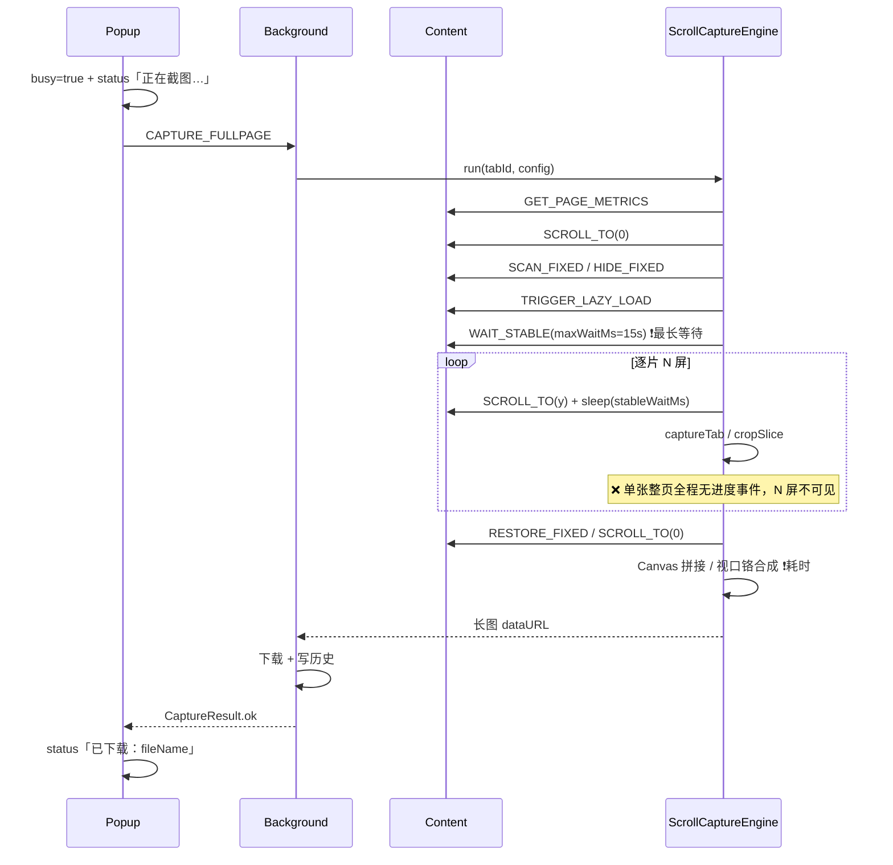

# 网页截图助手 · 截图状态与交互优化分析

> 文档类型：UX 交互分析（仅分析，不含实现代码）
> 基线版本：v1.1.0
> 分析对象：`entrypoints/popup/*`、`entrypoints/background.ts`、`core/*`、`types/*`
> 作者：产品经理（software-product-manager-3）

---

## 一、截图状态定义（状态机）

「截图状态」应被定义为一条**离散状态机**，覆盖从用户触发到结果落地的全生命周期。当前实现只隐式区分了「空闲 / 忙碌（busy）/ 成功 / 失败」四种，**没有独立的「超时」「取消」状态**，且「截图中」对单张截图只给一句 `正在截图…`。

### 1.1 状态机总览

### 1.2 状态明细表

| 状态 | 触发条件 | 退出条件 | 当前是否已有反馈 | 当前反馈形式 / 缺口 |
| --- | --- | --- | --- | --- |
| **idle 空闲** | popup 打开、无任务在跑（`busy=false`） | 用户点击任一截图入口 | ✅ 有 | 主按钮可点、无状态行（`App.tsx` `busy`/`status` 初值） |
| **preparing 准备中** | 点击主按钮（`onCapture`）或批量按钮（`onBatchTabs/Urls`） | 进入 capturing；area 模式关闭 popup 交给页面 overlay | ⚠️ 弱 | 单行 `status=info`：单张「正在截图…」、批量「正在批量截图…」、选区「已进入选区模式…」；主按钮仅 `disabled` 置灰，**无 loading 文案/图标** |
| **capturing 截图中** | background 收到 `CAPTURE_VISIBLE/FULLPAGE/AREA`、`BATCH_TABS/URLS` | 成功 → success；失败 → failed；超时 → timeout（未建模）；取消 → cancelled（未建模） | ⚠️ 弱 | 单张：仅「正在截图…」**无进度百分比、无阶段**；批量：`ProgressBar` 展示 `N/total · label`（`start/item/done` 事件驱动） |
| **success 成功** | `CaptureResult.ok=true`（下载 + 写历史完成后） | 发起新操作 / 关闭 popup | ✅ 有 | 单张 `status=ok`「已下载：fileName」；批量 `status=ok`「批量截图完成，已打包下载」+ `BatchSummary` |
| **failed 失败** | `CaptureResult.ok=false` 或 `request()` 抛错 | 用户重新操作 | ✅ 有 | 单张 `status=err` 单行红色原始错误文案；批量在 `BatchSummary.fail-list` 列出失败项 |
| **timeout 超时** | `WAIT_STABLE` 达到 `maxWaitMs`（默认 15s） | —— | ❌ **无** | `stable-wait.ts` 的 `waitUntilStable` **恒返回 `{stable:true}`**，超时仅作「已尽力」继续，未向 popup 上报「等待超时，可能内容未加载完整」 |
| **cancelled 取消** | 选区模式用户按 `Esc`（`overlay.cancel()`） | —— | ❌ **无** | 选区 `Esc` 后 popup 已 `window.close()`，`reject('已取消选区')` 的响应**丢失**（`onCaptureArea` 为 fire-and-forget `.catch(()=>{})`）；整页/批量**无取消入口** |

> 结论：当前状态机缺失「timeout」「cancelled」两个显式状态，且「preparing/capturing」在单张截图路径上反馈粒度不足（无阶段、无进度、无取消）。

---

## 二、当前截图交互完整流程

四条链路的「触发 → 状态反馈 → 结果处理」如下，标 ✅ 为已具备、⚠️ 为薄弱、❌ 为缺失。

### 2.1 可见区域截图（visible）

| 环节 | 现状 | 反馈 | 缺口 |
| --- | --- | --- | --- |
| 触发 | 点击「📸 截取可见区域」→ `onCapture('visible')` | `busy=true` + `status`「正在截图…」 | 无 loading 图标/文案变化 |
| 执行 | `CAPTURE_VISIBLE` → `captureVisible` → 原生 `captureTab`（<1s，无耗时阶段） | 仅「正在截图…」 | 快，无需进度 |
| 结果 | `maybeDownload` 自动下载 → `recordHistory` 写历史 | `status=ok`「已下载：fileName」 | 下载失败被静默吞掉，仍显示成功 |
| 异常 | `ok=false` → `status=err` 原始错误 | 单行红字 | 无重试、无友好文案 |

### 2.2 选定区域截图（area）

| 环节 | 现状 | 缺口 |
| --- | --- | --- |
| 触发 | 点击「选定区域」→ `status` 提示后 `window.close()` | 关闭 popup 是必要（选区需在页面操作），但**关闭后无任何结果/取消回显** |
| 执行 | `START_SELECTION` → `SelectionOverlay` 拖拽框选、实时尺寸、Esc/回车 | 交互本身完善（`overlay.ts`），但**成功/失败/取消均无反馈闭环** |
| 结果 | 裁剪 → 自动下载 → 写历史 | 用户只能看到「下载栏」的下载行为，无 toast、无预览 |

### 2.3 整页滚动截图（fullpage，核心链路）

| 环节 | 现状 | 缺口 |
| --- | --- | --- |
| 触发 | 点击「📜 整页滚动截图」→ `busy=true` +「正在截图…」 | 无阶段文案、无进度 |
| 执行 | 度量 → 回顶 → 扫 fixed → 懒加载 → `WAIT_STABLE`（最长 15s）→ 逐片滚动截图（N 屏）→ 拼接 | ❌ **全程无进度事件**（`ScrollCaptureEngine` 不 `emit`）；N 屏/等待稳定/合成这些耗时环节对用户完全黑盒 |
| 结果 | 自动下载 + 写历史 → `status=ok` | 无 toast、无「打开文件夹/预览/复制」 |
| 异常 | `ok=false` → 单行红字 | 无重试、无超时/取消区分、无超长页面耗时提示 |

### 2.4 批量截图（batch tabs / urls）

| 环节 | 现状 | 缺口 |
| --- | --- | --- |
| 触发 | 展开「批量截图」→ 点「按选项卡/按 URL 列表」→ `busy=true` + `progress=null` + `status=info` | 无「无效输入」即时校验反馈 |
| 执行 | `BatchTabsRunner` / `BatchUrlsRunner`：`onProgress(start)` → 逐个 `item(i,total,label)` → 失败自动重试 1 次 → `done(result)` | 进度百分比在 `start` 阶段为 0%，首项直接跳变；**重试期间 `index` 不变，进度条看似卡住**；无耗时/剩余估计 |
| 结果 | `done` → `ProgressBar` 显示进度条 + `BatchSummary`（成功 N / 失败 N + 失败清单） | ❌ 逐项成功/失败**仅在结束后的汇总**可见，过程中无逐项 ✅/❌ 标记 |
| 异常 | 失败项自动重试 1 次，最终在 fail-list 列出 | 无用户可触发的「手动重试」；`BatchUrlsRunner` 对非 http URL 静默 `filter` 丢弃、超 50 条静默 `slice` 截断，**无提示**；`BatchTabsRunner` 对 `chrome://` 等不可截取 tab 静默过滤，无提示 |

---

## 三、分方面优化方案

> 每方面按「现状问题 → 优化建议 → 预期效果」逐条，建议具体到文案与交互，可直接作为后续工程 backlog 依据。

### 3.1 状态反馈的实时性与清晰度（加载中提示、进度展示）

**问题 1：单张截图（尤其整页）只有一句「正在截图…」，全程黑盒，长页面可能静默十几秒。**
- 现状问题：`App.tsx` `onCapture` 仅设置 `status=info「正在截图…」`；`ScrollCaptureEngine`/`CaptureService` 对单张截图**不 `emit` 任何进度事件**；`busy` 仅让主按钮 `disabled` 置灰，按钮文案不变、无 spinner。
- 优化建议：
  1. 主按钮进入 loading 态：`disabled` + 文案动态化 + 内联 spinner，例如「⏳ 截图准备中…」。
  2. 给 `ScrollCaptureEngine` 增加分阶段进度回调（复用现有 `ProgressEvent` 协议或新增 `kind:'stage'`），按阶段推送：
     - 「准备中…」→「等待页面渲染稳定…」→「正在滚动截图 N/M 屏」→「正在拼接合成…」→「正在下载…」。
  3. 整页截图把「总屏数」预先算好（`buildPositions` 已能拿到 `positions.length`），在 `captureSlices` 逐片 `emit` `item`，popup 用 `ProgressBar` 展示百分比（可见区域快任务可不展示，仅展示阶段文案）。
- 预期效果：长页面截图从「静默等待」变为「实时可见的分阶段 + 百分比进度」，降低用户焦虑与「以为卡死」的误判。

**问题 2：批量进度条在 start 阶段为 0%、首项跳变、重试期间卡住。**
- 现状问题：`ProgressBar.tsx` 中 `current` 取 `item.index`，`start` 阶段 `current=0` 恒 0%；首项到达即跳变到 `1/total`；失败重试时 `index` 不变（`batch-tabs.ts`/`batch-urls.ts` 重试仍用 `i+1`），进度看似停滞。
- 优化建议：
  1. `start` 阶段显示「0/total · 准备中…」并让进度条为 0；`item` 阶段以「已完成项」而非「当前项」推进，即 `percent = (index-1)/total`，末项完成进入 `done` 时到 100%。
  2. 重试事件增加独立语义（如 `label` 前缀「重试」已存在，可再给 `item` 加 `retrying?: boolean`），UI 用「↻ 重试：xx」样式区分，避免用户误以为卡住。
  3. 增加「已耗时」与「预计剩余」：记录 `start` 时间戳，显示 `已耗时 Xs · 剩余约 Ys`（Y = 平均单页耗时 × 剩余页数）。
- 预期效果：进度推进平滑、重试可辨识、用户对批量总时长有预期。

**问题 3：popup 关闭/重开后，进行中的批量进度丢失。**
- 现状问题：`background.ts` 虽存了 `lastProgress` 并暴露 `GET_PROGRESS` 消息，但 popup `init()` **从不调用 `GET_PROGRESS`**；批量在 Service Worker 后台继续跑，用户重开 popup 看不到进度。
- 优化建议：popup `init()` 中调用 `GET_PROGRESS`，若有进行中进度则恢复 `progress`/`busy` 状态，并在 `done` 事件到达时正常收尾。
- 预期效果：批量截图不再因 popup 意外关闭而「失联」，进度可恢复。

### 3.2 异常情况的处理与提示（失败、超时、取消）

**问题 4：下载失败被静默吞掉，成功文案与真实结果不一致。**
- 现状问题：`background.ts` `maybeDownload`/`maybeDownloadZip` 用 `try/catch` 只 `log.error`，popup 仍显示「已下载：fileName」/「批量截图完成，已打包下载」，实际可能未落盘。
- 优化建议：
  1. `maybeDownload` 返回「下载是否成功」结果，失败时把 `CaptureResult` 标记为「截图成功但下载失败」并携带错误，popup 显示「✅ 截图完成，⚠️ 下载失败：<原因>（可点「重新下载」）」。
  2. 更简单方案：成功文案改为「截图完成：fileName」，下载结果单独用一条状态（`ok` 绿 / `warn` 黄）区分，避免「已下载」的虚假承诺。
- 预期效果：用户能准确知道截图是否真正保存到磁盘，失败可补救。

**问题 5：超时没有独立状态，用户无法知晓「内容可能未加载完整」。**
- 现状问题：`stable-wait.ts` `waitUntilStable` 达到 `maxWaitMs` 后直接 `return {stable:true}`，无超时语义；popup 无从感知「等待超时、可能截到未加载完的页面」。
- 优化建议：
  1. `waitUntilStable` 返回 `{stable: boolean; timedOut: boolean; elapsedMs}`（`stable=false` 且 `elapsedMs>=maxWaitMs` 时 `timedOut=true`）。
  2. 截图结果透传该标志（或 `CaptureResult` 增加 `warning?: string`），popup 在成功后追加黄色提示「⚠️ 页面等待超时，内容可能未加载完整」。
  3. 设置页 `maxWaitMs` 提示升级为「页面等待总上限，超时后按已加载内容截图」。
- 预期效果：超时从「静默兜底」变为「显式、可理解、可调参」的提示。

**问题 6：取消能力缺失（选区取消无回显、整页/批量不可取消）。**
- 现状问题：选区 `Esc` 后 popup 已关，`reject('已取消选区')` 响应丢失；整页/批量一旦开始无任何取消入口，长任务只能干等。
- 优化建议：
  1. 选区取消/失败的回显：由于 popup 已关闭，改为用**页面内 overlay toast** 回显（overlay 消失时在页面顶部短暂显示「已取消选区」），或借助 `browser.notifications` 轻量提示；也可考虑选区完成/取消后**自动重新唤起 popup** 展示结果（需要评估 popup 焦点策略，成本较高，列为 P1）。
  2. 整页/批量增加「取消」：popup 增加「取消」按钮（busy 态显示），向 background 发 `CANCEL_CAPTURE`，`ScrollCaptureEngine`/runner 在每片/每项之间检查取消标志并中止，返回 `cancelled` 状态。
- 预期效果：取消可预期、可反馈，用户不再被长任务「绑架」。

**问题 7：错误文案生硬（原始 Error 串），且失败后无重试入口。**
- 现状问题：单张失败直接把 `error`（如底层 `Error: ...`）红字展示；失败后用户只能手动重新点一次。
- 优化建议：
  1. 建立「错误码 → 友好文案」映射（权限不足 / 无法注入内容脚本 / 下载失败 / 页面超时 / 用户取消），展示用户能读懂的提示。
  2. 失败状态增加「重试」按钮，一键重新发起同模式截图。
- 预期效果：错误可理解、可自助恢复。

### 3.3 截图结果的呈现方式（预览、保存、复制、分享）

**问题 8：结果只有「自动下载 + 一句话」，缺少后续动作出口。**
- 现状问题：单张成功后 `status=ok「已下载：fileName」`，批量成功提示「已打包下载」；无「打开所在文件夹」「预览」「复制图片」入口；历史 Tab 有预览/重新下载/删除，但预览弹层无复制/另存。
- 优化建议：
  1. 单张截图成功后，在状态行旁提供快捷操作按钮：「🖼 预览」「📋 复制图片」「📁 打开文件夹」（`browser.downloads.show` 或 `open` 最近下载）。
  2. 「复制到剪贴板」：将 `dataUrl`/`Blob` 写入剪贴板（`navigator.clipboard.write([ClipboardItem])`），成功后 toast「已复制到剪贴板」。
  3. 「分享」：受扩展限制，桌面端以「复制图片/复制文件名」替代直接分享；「在新标签页打开」（已有）作为临时分享出口。
- 预期效果：截图后用户能立即预览、复制、定位文件，减少「下载到哪了」的困惑。

**问题 9：预览弹层功能单一。**
- 现状问题：`PreviewModal.tsx` 仅支持按钮放大/缩小/复位/新标签页打开/关闭，无滚轮缩放、拖拽平移、复制、另存。
- 优化建议：
  1. 增加滚轮缩放、按住拖拽平移、双击复位（`scale` 已有基础）。
  2. 工具栏增加「📋 复制图片」「💾 另存为」（触发重新下载）。
- 预期效果：预览从「看图」升级为「看图 + 直接取用」。

### 3.4 用户操作后的引导与提示（toast、动画、过渡效果）

**问题 10：反馈方式单一，缺 toast、动画、过渡。**
- 现状问题：所有反馈都是 `status` 单行文字（`status-line`），无自动消失、无动画；按钮无 loading 动画；批量面板 `
` 展开虽有 `▸` 旋转但整体偏静态；历史删除无确认（仅清空有 `window.confirm`）。
- 优化建议：
  1. 引入轻量 toast 系统：成功（绿 ✓）/ 失败（红 ✕）/ 信息（蓝）/ 警告（黄 ⚠）四类，2.5s 自动消失，支持多条堆叠；替代部分 `status` 单行。
  2. 主按钮 loading：内联 spinner + 文案随阶段变化；`busy` 时给按钮加 `@keyframes` 呼吸/脉冲动效。
  3. 进度条 `progress-fill` 已有 `transition: width 0.2s`，可再平滑为 0.3s + 尾端微光扫过动效。
  4. 成功/失败的状态行加入「淡入 + 上移」过渡；空状态（无历史）用插画/图标占位。
  5. 历史「删除」单条增加确认（或改为「删除后 toast + 撤销」）。
- 预期效果：反馈即时、语义清晰、有动感，整体更专业、更「跟手」。

---

## 四、多平台建议

当前是**浏览器扩展**（Chrome/Firefox/Safari），无移动端、无独立 Web 端。以下分别说明。

### 4.1 桌面浏览器扩展（主力，Chrome P0 / Firefox P0 / Safari P1）

- 沿用现有 popup + background + content 架构，直接落地第三章全部优化。
- 平台差异需在反馈层兼容：
  - **Chrome（MV3 Service Worker）**：`browser.downloads.download` 异步，需注意「下载完成」与「写历史」的时序；toast 用 popup 内 DOM 实现即可（SW 无法弹 DOM toast）。
  - **Firefox（MV2 Background）**：`captureTab` 权限与 `<all_urls>` 声明，下载与 Chrome 行为一致；toast/通知可用 `browser.notifications`（需用户授权）或 popup 内 DOM。
  - **Safari（降级）**：仅可见区域，`degrade-banner` 已常驻提示；优化时应保留该横幅，并针对「整页/选区/按 URL 禁用」给禁用态明确 tooltip 原因（当前仅 `disabled` 置灰，无原因说明）。

### 4.2 移动端（当前不适用，需说明降级/独立方案）

- **现状**：扩展无移动端。核心 API `tabs.captureVisibleTab` 是**桌面浏览器**能力，移动浏览器（iOS Safari、Android Chrome）**不支持扩展 + 无对应截图 API**。
- 可行性与建议（如需覆盖，应视为**独立产品**而非本扩展延伸）：
  1. **移动浏览器内（H5）**：无法截取「整个页面」原生合成；可退化为 `html2canvas`/`dom-to-image` 的 DOM 重渲染方案（本产品明确不采用，见 PRD「非目标」），且跨域/`foreignObject`/字体问题多，质量远低于原生。
  2. **移动原生 App**：系统级截屏由 OS 提供，App 只能截「自身视图」；整页需 WebView `capture` 或逐屏滚动拼接（类似桌面引擎，但移动端 DPR 高、内存敏感，需分块压缩，见 PRD Q8）。
  3. **建议**：移动端不作为本次优化范围；若未来立项，优先做「移动浏览器长截图」的独立 MVP（滚动拼接思路可复用，但 UI/权限/下载完全重做）。
- 结论：移动端「无法用 captureVisibleTab」，需独立方案或明确不做。

### 4.3 Web 端（当前不适用，需说明）

- **现状**：无独立 Web 站。纯 Web 页面受浏览器同源/权限限制，**无法截取「浏览器标签页」，更无法截取任意 URL**。
- 可行性与建议：
  1. 若指「Web 版工具页（用户粘贴 URL 生成截图）」，需自建**服务端无头浏览器**（Puppeteer/Playwright）渲染 + 截图，与现有扩展客户端方案完全不同，涉及服务器成本、鉴权、反爬、渲染一致性。
  2. 若指「网页内的自截图」（当前页生成整页长图），退化为 `html2canvas` 类方案，同样与本产品「原生截图 API」定位冲突。
- 结论：Web 端为独立产品线，不建议在本扩展迭代中混入。

---

## 五、优先级建议（backlog 依据）

| 优先级 | 编号 | 优化项 | 对应章节 | 一句话理由 |
| --- | --- | --- | --- | --- |
| **P0** | A1 | 单张（整页）截图增加分阶段 + 百分比进度反馈 | 3.1-问题1 | 核心链路当前黑盒，是体验最大痛点 |
| **P0** | A2 | 下载失败不再静默吞掉，成功文案与真实结果一致 | 3.2-问题4 | 消除「假成功」误导 |
| **P0** | A3 | 选区截图的成功/失败/取消反馈闭环 | 3.2-问题6、2.2 | 选区结果完全无回显 |
| **P0** | A4 | 超时状态显式建模与提示（含 `timedOut` 透传） | 3.2-问题5 | 补全状态机缺失状态 |
| **P0** | A5 | 整页/批量增加「取消」入口与中止机制 | 3.2-问题6 | 长任务不可控 |
| **P1** | B1 | 批量进度增强：平滑百分比、重试可辨识、耗时/剩余 | 3.1-问题2 | 批量体验细节 |
| **P1** | B2 | 失败友好文案 + 一键重试 | 3.2-问题7 | 降低自助恢复成本 |
| **P1** | B3 | 结果呈现增强：成功后「预览/复制/打开文件夹」快捷操作 | 3.3-问题8 | 补全结果出口 |
| **P1** | B4 | 复制到剪贴板能力 | 3.3-问题8 | 高频诉求 |
| **P1** | B5 | popup 重开恢复进行中进度（接入 `GET_PROGRESS`） | 3.1-问题3 | 修复进度失联 |
| **P1** | B6 | 批量无效输入提示（非法 URL 过滤/超 50 截断/不可截取 tab 过滤） | 2.4 | 消除静默丢数据 |
| **P2** | C1 | 预览弹层增强：滚轮缩放、拖拽平移、复制/另存 | 3.3-问题9 | 锦上添花 |
| **P2** | C2 | 引入 toast 系统 + 按钮 loading/过渡动画 + 删除确认/撤销 | 3.4-问题10 | 视觉打磨 |
| **P2** | C3 | 移动端 / Web 端独立方案调研（仅立项参考，不混入本扩展） | 4.2/4.3 | 范围边界 |

> 建议实施顺序：先做 **P0（A1~A5）** 补齐状态机与反馈闭环，再上 **P1（B1~B6）** 打磨批量与结果出口，最后 **P2** 做视觉与外围。P0 中 A1 与 A4、A5 都涉及 `core/scroll-capture.ts`、`core/content/stable-wait.ts`、`types/messages.ts` 的进度/取消/超时协议扩展，建议由架构师统一设计消息协议后一并落地，避免三处各自改协议造成冲突。
